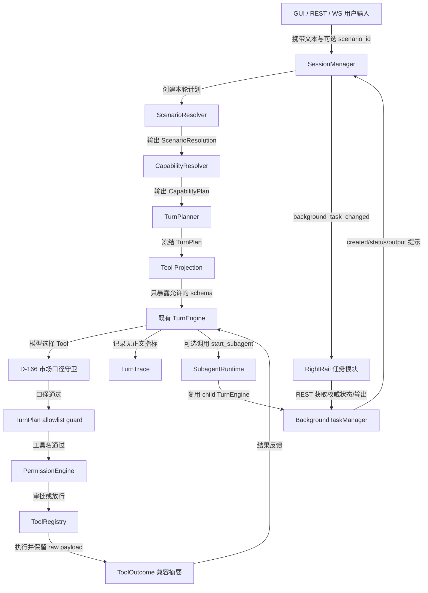
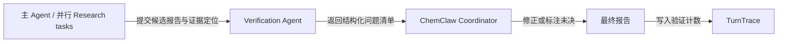
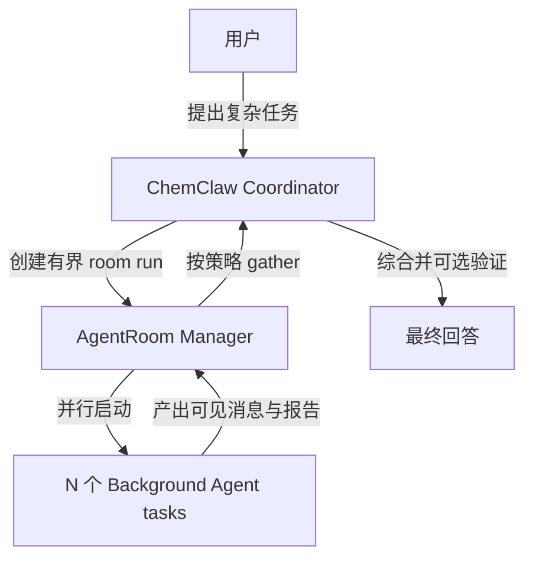

# ChemClaw → Cursor 完整工程交接（2026-08-20）

> 适用范围：ChemClaw Agent Harness 大目标，以及与之直接相关的 Python / FastAPI / React / Tauri 工作。
>
> 文档状态：交接快照。它描述的是工作树 `chemclaw-UI` 在提交 `98d9ce64eb851dec5940878a206a481ded194e05` 之上的 **D-168—D-172 未提交实现**。不要只看 Git HEAD，也不要假设工作区干净。
>
> 最重要的结论：Phase 1 和 Phase 2 已实现；接下来应先固化当前改动，再按 Phase 3 → Phase 4 → Phase 5 → Phase 6 小步推进。禁止一次性重写。

---

## 0. 给 Cursor 的最短开场提示

把下面这段和本文件一起交给 Cursor：

```text
你现在接手 ChemClaw。工作目录固定为：
D:\OpenWorker\openworker\.worktrees\chemclaw-UI

不要依赖旧聊天，不要假设 Git 工作区干净。先完整阅读：
1. AGENTS.md
2. docs/chemclaw/CURSOR_HANDOFF_2026-08-20.md
3. docs/chemclaw/README.md
4. docs/superpowers/specs/2026-07-29-chemclaw-product-design.md
5. docs/chemclaw/DECISIONS.md
6. docs/chemclaw/DOMAIN.md
7. docs/chemclaw/TESTING.md
8. 当前任务对应的 specs/plans

当前 Git HEAD 是 98d9ce6，但工作树包含尚未提交的 D-168—D-172。严禁 reset、checkout 覆盖、clean、整文件恢复或删除这些改动。先用 git status、git diff --stat、git diff --check 核对实际状态。

ChemClaw 是唯一产品和唯一主 Coordinator。保留现有 TurnPlanner、TurnEngine、ToolRegistry、MCPManager、PermissionEngine、Conversation、Memory、Compaction；不要引入第二套 Agent Loop/Session/Permission/Memory。

Phase 1 Scenario/Capability/Preview/Trace/ToolOutcome 已完成；Phase 2 SubagentRuntime、BackgroundTaskManager 和右栏任务闭环已完成。下一步不是重做 Phase 1/2，而是先为 Phase 3（ExecutionHookBus + fallback policy + verification-agent）写 D-173 规格和实施计划，等待用户批准，再逐个小任务实现。

每个任务开始前用中文说明：当前状态、任务边界、验收标准、预计修改范围。每次只完成一个可独立验收的小任务；完成后更新 README/DECISIONS/DOMAIN/TESTING，报告真实测试和 git diff 摘要。
```

---

## 1. 权威信息顺序

发生冲突时按以下顺序判断：

1. 当前用户明确要求。
2. 仓库根目录 `AGENTS.md`。
3. 当前真实代码、`git status` 和测试结果。
4. 已批准的 `docs/chemclaw/DECISIONS.md`。
5. 当前阶段规格与实施计划。
6. `docs/chemclaw/README.md`、`DOMAIN.md`、`TESTING.md`。
7. 本交接文档。
8. 旧聊天、截图、原始大目标提示。

本文件用于减少重新审计成本，但不能覆盖更新后的代码事实。如果 Cursor 接手时 HEAD、分支或工作树已经变化，必须先停下来更新本文件中的快照结论。

---

## 2. 产品背景与最终目标

ChemClaw 是芯化和云面向化工行业的 Windows、本地优先、单用户 AI 桌面产品。它不是普通聊天机器人，长期目标是：

```text
一个统一的 ChemClaw 主 Agent / Coordinator
+ 场景化入口
+ 业务能力路由
+ Skill
+ Tool / MCP / API
+ Subagent
+ 后台任务
+ 多 Agent 协作
+ 企业微信等消息渠道
+ GUI
```

产品必须 GUI-first。CLI/TUI 可以保留为工程或兼容入口，但不能成为产品主入口。

用户主要面对统一的 `ChemClaw`，不应该为了每种任务频繁切换不同龙虾。专业角色可以存在，但任务路由优先由 Scenario 和 Capability 决定。

### 2.1 必须区分的概念

| 概念 | 含义 | 不能混同为 |
| --- | --- | --- |
| ChemClaw | 唯一主要 Coordinator / 主 Agent | 多个并列产品 Agent |
| Persona / 智能体 | 角色、风格、默认 Skills、工具和权限建议 | Scenario |
| Scenario | 用户当前要完成的业务场景 | Skill 或独立 Agent |
| Capability | 稳定的上层业务能力 | ToolRegistry 的复制品 |
| Skill | 可复用知识、方法、流程 | 自然语言意图分类器 |
| Tool / MCP / API | 真正执行操作或获取数据 | 上层业务场景 |
| Subagent | 独立、复杂、隔离上下文或并行子任务 | 所有请求的默认路径 |
| Background Task | Agent/Shell 的持久生命周期记录 | 对话 turn 或隐藏推理 |
| Router / Planner | 决定本轮执行强度、场景、工具和上下文 | PermissionEngine |

### 2.2 用户最初的大目标

- 明确 Scenario → Capability → Provider/Tool 路径，减少无意义 Web 搜索和工具调用。
- 简单结构化查询尽量 1 个正确 Tool、0 次通用 Web、模型 round trip 不超过 2。
- 复杂研究可以并行 Subagent，并成为可见、可停止、可续发、可恢复的后台任务。
- 增加内部 Hook Pipeline、声明式 fallback 和专门找错的 Verification Agent。
- GUI 由同一 Scenario Registry 渲染场景分类、卡片、搜索、推荐和 readiness。
- 后续支持最小 AgentRoom，以及企业微信/飞书/钉钉等 Channel Adapter。
- 其他项目仅作 donor；ChemClaw 始终是宿主 Runtime。

---

## 3. 不可违反的产品与架构边界

1. 正常界面、安装程序、快捷方式、图标和产品文案只显示 ChemClaw；OpenWorker 仅保留许可证与内部兼容命名。
2. 永远不实现 UI Demo 中的“数据底座”页面。
3. 默认简体中文，支持英文；第一方错误、审批、安装和配置也必须中英文可用。
4. 所有可见按钮必须有真实后端和状态闭环。
5. 保留并回归验证现有对话、MCP、权限、审批、自动化、Memory 和 Compaction。
6. `PermissionEngine` 永远是工具执行的最终授权权威。Planner、Projection、Hook 和 Subagent 都不能提升权限。
7. 保留单一 `TurnEngine` 执行循环；禁止引入 OpenHarness QueryEngine、LangGraph Graph Runtime、AutoGen/CrewAI/MAF runtime 作为第二内核。
8. 不为每个 Scenario 新建 Persona/Agent；用户不需要频繁切 Agent。
9. Scenario 不直接散落底层 Tool 名；精确 binding 只能在 Capability Provider 中维护。
10. 不用自然语言直接匹配 Skill。顺序必须是 Scenario/Intent → Capability → Tool/MCP/API → Skill → 必要时 Subagent。
11. 不默认给所有请求启动 Subagent；简单价格、CAS、单事实查询必须保持直达路径。
12. 不把隐藏 chain-of-thought 展示给用户。可展示任务说明、状态、工具工作记录、系统事件和最终报告。
13. 不自动抽取/巩固长期 Memory；现有 Memory 保持显式、用户可控。
14. 不批量引入新依赖，不做无法验证的大爆炸重构。
15. 未经用户明确确认，不合并 `main`、不构建正式安装包、不做管理员安装、不写真实外部系统。

---

## 4. 当前真实 Git / Worktree 快照

| 项目 | 当前值 |
| --- | --- |
| Worktree | `D:\OpenWorker\openworker\.worktrees\chemclaw-UI` |
| 分支 | `chemclaw-UI` |
| HEAD | `98d9ce64eb851dec5940878a206a481ded194e05` |
| Python 入口 | `.venv\Scripts\python.exe` |
| GUI | `surfaces\gui` |
| 开发状态目录 | `D:\OpenWorker\.chemclaw-dev\state` |
| 后端端口 | `8765` |
| Vite 端口 | `1420`，浏览器使用 `http://localhost:1420` |

### 4.1 工作树不是干净的

交接前的 `git diff --stat`：

```text
34 tracked paths changed
1710 insertions(+)
920 deletions(-)
```

这个统计 **不包含大量 untracked 新模块和测试**。当前修改是 D-168、D-169、D-170、D-171、D-172 连续叠加的结果，不适合按文件粗暴拆回。

主要 tracked 修改：

- Runtime：`agent.py`、`config.py`、`engine.py`、`turn_planner.py`、`tool_projection.py`、`tool_policy.py`、`tools/registry.py`、`tools/shell.py`。
- Server：`server/app.py`、`server/manager.py`。
- GUI：`App.tsx`、`api.ts`、`RightRail.tsx`、`Sidebar.tsx`、`styles.css`、`types.ts`、i18n 文件及测试。
- 文档：README、DECISIONS、DOMAIN、TESTING。
- 删除：`AuditView.tsx`；`LeadsWorkbench*`；`requestLeadFollowup*`。

主要 untracked 有效实现：

- `coworker/scenarios/`
- `coworker/capabilities/`
- `coworker/tracing/`
- `coworker/background_tasks/`
- `coworker/subagents/`
- `coworker/tools/outcome.py`
- Phase 1/2 Python 测试
- `BackgroundTasksSection.tsx` 及其测试
- D-168—D-172 规格和计划
- `.vscode/`、`uv.lock`

### 4.2 绝对禁止的 Git 操作

- 禁止 `git reset --hard`。
- 禁止 `git checkout -- <file>` 或 `git restore <file>` 覆盖用户改动。
- 禁止 `git clean -fd`。
- 禁止把 `App.tsx`、`i18n.tsx`、README 等高冲突文件整文件替换。
- 禁止删除无权访问的 `.pytest-d169-*` / `.pytest-d171-*` 目录或修改其 ACL。
- 禁止为了全绿恢复已退役的 `AuditView` 或 `LeadsWorkbench`。

Cursor 的第一个工程动作应是核对并保护这批改动。若要提交，先向用户确认提交策略；建议按 D-168、D-169/170、D-171、D-172 语义检查后形成可审阅 checkpoint，而不是继续把 Phase 3 叠在一个无限增长的未提交 diff 上。

---

## 5. 当前单一执行架构



### 5.1 关键接缝

- `TurnPlanner.plan()`：唯一逐轮规划接缝。
- `TurnEngine.run/retry/resume/_loop`：唯一模型与工具执行循环。
- `ToolRegistry`：工具注册和执行权威。
- `PermissionEngine`：权限和审批权威。
- `MCPManager`：现有 lazy persistent MCP/OAuth 权威，不替换。
- `BackgroundTaskManager`：Agent/Shell 后台生命周期权威。
- REST/SQLite：任务恢复权威；WS 只是刷新提示。

---

## 6. 代码目录导航

### 6.1 后端核心

| 路径 | 职责 |
| --- | --- |
| `coworker/agent.py` | `build_engine()`、全局 prompt 附录、Subagent 委派指导与工具装配 |
| `coworker/engine.py` | 唯一 TurnEngine 循环、guard、Permission、Trace 接线 |
| `coworker/turn_planner.py` | Router/Profile/Scenario/Capability/工具与 Skill 的逐轮 TurnPlan |
| `coworker/request_router.py` | 确定性门禁、规则、最多一次轻量分类器 |
| `coworker/tool_projection.py` | Provider-visible Tool schema 投影 |
| `coworker/tool_policy.py` | Tool 策略辅助 |
| `coworker/tools/registry.py` | ToolDescriptor、schema、callable、执行 |
| `coworker/market_intent.py` | D-166 市场意图与口径 |
| `coworker/permissions.py` | 既有权限与审批 |
| `coworker/mcp/` | MCPManager 与连接实现 |
| `coworker/compaction.py` | 上下文压缩与预算 |
| `coworker/memory/` | 用户可控本地 Memory |

### 6.2 Phase 1 新模块

| 路径 | 深模块 interface |
| --- | --- |
| `coworker/scenarios/` | `ScenarioRegistry`、`ScenarioResolver.resolve()`、`TurnPlanPreview` |
| `coworker/capabilities/` | `CapabilityRegistry`、`CapabilityResolver.resolve()` |
| `coworker/tracing/` | `TurnTraceRecorder`、`TurnTraceStore` |
| `coworker/tools/outcome.py` | `normalize_tool_outcome()`、`ToolExecutionResult` |

### 6.3 Phase 2 新模块

| 路径 | 深模块 interface |
| --- | --- |
| `coworker/background_tasks/` | start/get/list/read/send/stop/wait/gather/listeners |
| `coworker/subagents/` | Profile registry、SubagentRuntime、模型工具 |
| `coworker/server/manager.py` | runtime adapter、WS task change transport |
| `coworker/server/app.py` | Scenario/Trace/Subagent/Task REST |
| `surfaces/gui/src/components/BackgroundTasksSection.tsx` | 只接收 `sessionId/refreshKey` 的任务 UI 深模块 |
| `surfaces/gui/src/components/RightRail.tsx` | 放置任务模块，不持有任务业务逻辑 |

### 6.4 前端

| 路径 | 职责 |
| --- | --- |
| `surfaces/gui/src/App.tsx` | 会话状态与 WS 事件分发 |
| `surfaces/gui/src/api.ts` | 本地 sidecar REST adapter |
| `surfaces/gui/src/types.ts` | WS/Event 类型 |
| `surfaces/gui/src/interfaceMessages.ts` | 第一方中英 UI 文案 |
| `surfaces/gui/src/styles.css` | RightRail/任务卡样式 |

---

## 7. 已完成里程碑：不要重做

| 决策 | 已完成内容 | 当前结论 |
| --- | --- | --- |
| D-165 | 每轮 TurnPlanner、按需 prompt/tool/Skill 投影、ApiHub 真流式 | 保留唯一 Planner seam |
| D-166 | 化工现货/国内期货/全球期货口径、澄清和执行守卫 | 市场规则高优先级，不重写 |
| D-168 | 退役 GUI“客户清单”侧栏 | Tool/Skill/对话产物保留 |
| D-169 | Scenario/Capability/Preview/Trace/ToolOutcome/allowlist guard | Phase 1 已完成 |
| D-170 | 删除普通用户“活动/执行诊断”页 | 后端诊断 API 保留 |
| D-171 | SubagentRuntime + BackgroundTaskManager | Phase 2 runtime 已完成 |
| D-172 | 复杂研究自动获得 Subagent 工具、RightRail 任务可见/停止/续发/恢复 | Phase 2 最小产品闭环已完成 |

---

## 8. Phase 1 的实际合同

### 8.1 当前内置 Scenario

| Scenario | 用途 | Subagent eligibility |
| --- | --- | --- |
| `chemical_spot_price` | 化工现货价格/趋势 | 否 |
| `cn_futures_market` | 国内期货报价/OHLC | 否 |
| `chemical_identity` | CAS、名称、分子式 | 否 |
| `chemical_company_research` | 化工企业与经营证据研究 | 是 |
| `chemical_market_research` | 市场、供需、产业链与趋势研究 | 是 |

### 8.2 当前内置 Capability

- `market.price.chemical_spot`
- `market.price.cn_futures.quote`
- `market.ohlc.cn_futures`
- `chem.identity`
- `company.identity`
- `research.web.search`
- `research.web.fetch`
- `interaction.clarify`

Scenario 只引用 Capability ID；精确 Tool/MCP binding 只在 `coworker/capabilities/registry.py`。

### 8.3 Scenario 匹配规则

1. 有效显式 `scenario_id`：置信度 1.0。
2. D-166 市场/化学确定性 adapter。
3. examples、aliases 和规则 matcher。
4. 无匹配回落 General ChemClaw。

阈值：

- top ≥ 0.80 且领先第二名 ≥ 0.15：自动匹配。
- top ≥ 0.50 但不满足高置信：返回候选/澄清。
- top < 0.50：General，不强行分类。
- “甲醇最近走势”固定歧义，必须问现货或期货。
- 无效显式 Scenario：REST 422；WS `input_rejected`。

### 8.4 当前开关默认值

`coworker/config.py` 当前以下候选开关均为 `True`：

- `request_routing_enabled`
- `tool_projection_enabled`
- `scenario_resolution_enabled`
- `prompt_projection_enabled`
- `structured_tools_true_streaming_enabled`
- `emergency_finalization_enabled`

修改任一开关必须保留独立 OFF parity。尤其 Scenario OFF 时必须恢复 D-165/D-166 legacy 行为。

### 8.5 REST / WS

现有 REST：

- `GET /v1/scenarios`
- `POST /v1/sessions/{session_id}/plan-preview`
- `GET /v1/turn-traces`
- `GET /v1/turn-traces/{trace_id}`

WS `user_message` 支持可选 `scenario_id`；`turn_start/turn_end` 可附 trace/plan 摘要；无效输入用 `input_rejected`。

### 8.6 Trace 隐私边界

TurnTrace 只能保存：

- trace/session/source 标识。
- Scenario/route/capability/tool 名称。
- model/tool/web/subagent 调用计数。
- token 数、阶段耗时、fallback、Outcome 分类和最终状态。

严禁保存消息正文、system prompt、工具参数、工具结果、reasoning、`ToolOutcome.data` 或 `source_refs`。Trace 与 Audit 分表；保留 30 天、最多 5000 条。

### 8.7 Phase 1 尚未产品化的部分

- Preview/Trace 是内部诊断能力，D-170 已删除普通用户“活动”页。
- 首批只有 5 个 Scenario / 8 个 Capability，不能把 taxonomy 无限制扩张成第二套 ToolRegistry。
- 运行后自动 retry/切源尚未实现，等待 Phase 3 Hook/Fallback。
- ToolOutcome 仍是兼容层，不要求所有 legacy Tool 一次性迁移。

---

## 9. Phase 2 的实际合同

### 9.1 SubagentProfile

当前字段：

```text
id/title/description/agent_id
mode/model/effort/max_turns
tool_allowlist/disallowed_tools
skills/mcp_servers
background/isolation/allow_nested
instructions
```

当前内置 Profile：

| Profile | 能力 | 隔离 | 限制 |
| --- | --- | --- | --- |
| `explore` | 代码搜索、读取、Git 只读 | `read_only` | 无 Shell/写入/嵌套，10 turns |
| `research` | Web、化学/企业数据、声明 MCP、本地产物只读 | `read_only` | 无写入/嵌套，32 turns |
| `worker` | 共享工作区执行 | `shared_workspace` | 仍逐 Tool 经 Permission/审批，禁止嵌套，32 turns |

`research` 已在真实验收后补入 `read_file/list_files`，但不含 `write_file`。

### 9.2 BackgroundTask 状态机

状态：

```text
queued → running → completed | failed | cancelled
queued/running --应用重启--> interrupted
completed Agent --用户续发--> queued → running → terminal
```

统一记录 Agent 和 Shell：

- owner session、parent task/trace、child session。
- Profile、workspace、model、时间、run count、output size、exit code、error。
- 输出单独按单调 cursor/seq 存储。

关键语义：

- Agent 完成后可以续发消息并复用 child conversation。
- Shell 不接受续发消息，也不在重启后自动重放。
- stop 是协作式中止；Shell adapter 会终止进程树。
- gather 按输入 task id 顺序返回，不因一个失败丢掉其他结果。
- owner session 是读取和控制隔离边界。
- manager listener 失败不能影响 task。

### 9.3 模型可用工具

- `start_subagent`
- `background_task_status`
- `background_task_output`
- `background_task_send`
- `background_task_stop`
- `background_task_gather`
- legacy `explore(task)` 仍返回 `{report}`

### 9.4 自动委派策略

匹配 `allow_subagent=true` 且 route 为 `AGENT/DEEP_RESEARCH` 时：

- Planner 把 Subagent 控制工具合入本轮工具面。
- prompt 注入短政策：至少两个互不依赖研究分支才启动，最多 3 个 `research` 后台任务。
- 主 Agent 在子任务运行时继续有用工作，最终综合前 gather。
- 单事实、简单价格、身份查询不启动。

Planner 只声明 eligibility。只有模型实际成功调用 `start_subagent` 才产生任务；`TurnPlanPreview.subagent_started=false` 在规划期是正常的。

### 9.5 GUI 产品闭环

`BackgroundTasksSection` 只接收 `sessionId/refreshKey`：

- 当前 session 没任务时整个区域不渲染。
- 有任务时 RightRail 显示“子智能体与后台任务”。
- 可看类型/Profile、状态、耗时、run count、工作记录和最终报告。
- 运行中可停止。
- Agent 可续发；Shell 不显示续发。
- WS `background_task_changed` 只触发刷新；REST/SQLite 是权威。
- 页面刷新、切回会话、服务重启后可恢复任务。

### 9.6 实机证据

真实 ApiHub CN `deepseek-v4-pro` 会话 `c3b686dc-2f8`：

- 主 Agent 实际调用 `start_subagent` 3 次。
- 创建上游原料、下游用途、代表企业 3 个 `research` task。
- 父轮 Provider 出现 `Request timed out` 后 child 仍继续并全部完成。
- 服务重启后同一 3 个 task 与输出恢复。
- 在右栏给已完成“代表企业”任务续发后，同一 task `run_count=2`，实际调用 `read_file`、继续检索并再次 `completed`，`error=null`。

这证明后台生命周期不依附父 HTTP/WS/model round。

### 9.7 Phase 2 尚未覆盖的理想合同

这些不是回归，而是明确的后续范围：

- Profile 没有独立 `timeout` 字段；前台 timeout 当前按 `max_turns * 30s` 计算。
- 没有显式 `max_depth` 字段；当前用 `allow_nested=false` 实现第一层禁止递归。
- 没有 `capability_filter`；当前使用 Tool allowlist、Skill 和声明 MCP。
- 没有 `output_schema` / typed structured report。
- 没有 task 百分比 progress、阶段 checklist、pause/resume。
- 没有完整 `parallel([...])` 高层接口；当前通过多次 start + gather 实现。
- 没有 deterministic 自动 spawn；模型在 eligible 工具面内决定是否调用。
- 没有 AgentRoom、群聊、debate、handoff。
- 没有 worktree/remote isolation；`worker` 只支持 shared workspace。
- 没有跨进程恢复到 Tool 指令中点；重启只调和为 interrupted，防止副作用重放。

---

## 10. Server 接口总览

### 10.1 Scenario / Trace

- `GET /v1/scenarios?session_id=...`
- `POST /v1/sessions/{session_id}/plan-preview`
- `GET /v1/turn-traces?session_id=...&limit=...`
- `GET /v1/turn-traces/{trace_id}`

### 10.2 Subagent / Background Task

- `GET /v1/subagent-profiles`
- `POST /v1/background-tasks/agent`
- `GET /v1/background-tasks?session_id=...`
- `GET /v1/background-tasks/{task_id}?session_id=...`
- `GET /v1/background-tasks/{task_id}/output?session_id=...&cursor=...&max_chars=...`
- `POST /v1/background-tasks/{task_id}/messages`
- `POST /v1/background-tasks/{task_id}/stop`
- `POST /v1/background-tasks/gather`

所有接口沿用本地 sidecar token 鉴权。跨 session task id 应返回不可见/拒绝，不能靠猜 id 读取或控制。

---

## 11. 安全、隐私和副作用约束

- Profile 是平台可信配置；模型只能选择注册的 profile，不能在调用参数中拼权限。
- `worker` 的共享工作区不等于自动写权限。
- 所有实际 Tool 仍经过 D-166 guard、TurnPlan allowlist、PermissionEngine 和 ToolRegistry。
- Hook（未来）只能进一步拒绝或转换内部结果，不能绕过 Permission 放行。
- 只读结构化 Provider 失败后不得默认用 Web 猜数据。
- `NO_DATA`、`AUTH_REQUIRED`、`UNAVAILABLE` 必须保持不同语义。
- 后台 task metadata、WS change、Trace 不保存 prompt、tool args/results、凭据或 reasoning。
- GUI 不提供权限提升入口。
- Shell/Tool 副作用在重启后不自动重放。
- 企业微信等 Channel Adapter 未来也不能持有 Agent 执行逻辑或秘密明文。

---

## 12. 成熟 donor 项目与采用边界

Phase 2 不是从零发明。D-171 固定对照了：

| 项目 | 固定参考 | 借鉴内容 | 明确不引入 |
| --- | --- | --- | --- |
| OpenHarness | `HKUDS/OpenHarness@9b2efd795c6aa09f88b0c257d269a9e518da6ae7` | Agent/Shell task lifecycle、status/output/stop/write/listener、Windows argv 安全 | QueryEngine / 整套 runtime |
| DeerFlow | `bytedance/deer-flow@a5acc25de6742b2166b3f41c97bd895822277b94` | 独立 child context、started/completed/failed、取消和 terminal 清理 | 整个 Lead Agent runtime |
| OpenAI Agents SDK | `openai/openai-agents-python@2af94722d93a5a1719af33ab7559ba79cc778f7f` | manager-owned agent-as-tool、父子 trace、外层 approval | 替换 ChemClaw Planner/Engine |
| LangGraph | 官方 durable execution 语义 | thread/checkpoint、interrupt/resume、幂等副作用思想 | Graph runtime |

后续 donor：

- Hook / ToolOutcome：OpenHarness、Pydantic AI、MAF middleware。
- Verification / trace：OpenAI Agents SDK、研究型 Agent 项目。
- GUI / runtime 解耦与 sandbox：DeerFlow、Agno。
- Room：Microsoft Agent Framework、AutoGen，仅吸收 Manager/Selector/Handoff 合同。
- WeCom / IM Gateway / Plugin：LangBot，仅吸收 adapter 和 gateway。

每次引用 donor 前必须重新核对许可证、固定 commit、接口和测试；禁止从默认分支盲抄最新代码。

---

## 13. 运行开发环境

### 13.1 一键重启

```powershell
cd D:\OpenWorker\openworker\.worktrees\chemclaw-UI
powershell -File .\scripts\restart-chemclaw-dev.ps1
```

行为：释放 8765/1420 → 启动后端 → 等健康检查 → 启动 Vite。

浏览器：

```text
http://localhost:1420
```

必须使用 `localhost`。每次后端重启会重写 sidecar token，因此前端也要重启。

### 13.2 健康检查

```powershell
Invoke-RestMethod http://127.0.0.1:8765/v1/health
```

不要在日志、文档或对话中输出 `sidecar-8765.token`、模型 key、MCP token 或 SecretStore 内容。

---

## 14. 当前测试基线

### 14.1 Phase 1

```text
Router/Planner/Projection/Market + Scenario/Capability/Outcome/Trace/REST/WS：170 passed
Scenario/Capability 1000 次确定性解析：P95 < 10 ms
缓存 Preview、无 classifier：P95 < 50 ms
```

### 14.2 Phase 2 Runtime

```text
BackgroundTask/Subagent/Shell/Permission/Stop：85 passed
Harness/Planner/Trace：134 passed
D-166 国内行情/市场守卫：89 passed
Automation：21 passed
```

### 14.3 Phase 2 产品闭环

```text
Planner/Scenario Projection + Task lifecycle/WS + Subagent REST + Tool Projection：52 passed
BackgroundTasksSection + RightRail + session resume + localization：34 passed
npm run build：通过，仅既有 dynamic-import/chunk-size 警告
python -m compileall -q coworker：通过
```

### 14.4 推荐聚焦命令

每次使用新的 basetemp，不要复用受 ACL 污染的目录：

```powershell
cd D:\OpenWorker\openworker\.worktrees\chemclaw-UI
$env:NO_PROXY='127.0.0.1,localhost'
$env:no_proxy='127.0.0.1,localhost'
$env:Path=(($env:Path -split ';' | Where-Object { $_ -notmatch 'OpenAI\.Codex' }) -join ';')
$ccBaseTemp='D:\OpenWorker\.chemclaw-dev\pytest-tmp\cursor-d172-baseline'
.\.venv\Scripts\python.exe -m pytest `
  tests/test_subagent_runtime.py `
  tests/test_background_tasks.py `
  tests/test_turn_planner.py `
  tests/test_agent_harness_routing.py `
  tests/test_tool_projection.py `
  --basetemp=$ccBaseTemp -p no:cacheprovider -q
```

GUI：

```powershell
cd D:\OpenWorker\openworker\.worktrees\chemclaw-UI\surfaces\gui
npm.cmd test -- BackgroundTasksSection.test.tsx RightRail.artifacts.test.tsx localization-audit.test.ts sessionResume.test.ts
npm.cmd run build
```

静态：

```powershell
cd D:\OpenWorker\openworker\.worktrees\chemclaw-UI
.\.venv\Scripts\python.exe -m compileall -q coworker
git diff --check
```

### 14.5 已知环境污染

不要声称 Python 全量绿色。Windows `SecretStore` 会把部分 pytest 临时 state 目录 ACL 收紧，导致后续 `PermissionError/WinError 5`。当前残留包括若干 `.pytest-d169-*`、`.pytest-d171-*` 目录；当前受控身份无权清理。

另外已知：

- Windows symlink/POSIX mode 断言不等价。
- FakeSlack/Relay 受代理和异步时序影响。
- 全量 WS 组合曾停滞。
- GUI 历史全量有旧英文断言和 UpdateBanner 时序失败。

规则：报告实际执行到哪里、哪些是新增失败、哪些是既有环境失败；不得删断言或加固定 sleep 制造全绿。

---

## 15. 剩余工作总路线

下面是 Agent Harness 大目标的剩余工作，不是一个可以一次实现的单任务。

| 阶段 | 目标 | 前置 | 当前状态 |
| --- | --- | --- | --- |
| Stabilize | 保护并 checkpoint D-168—D-172，建立可回退基线 | 用户确认提交策略 | 尚未提交 |
| Phase 3A | 内部 ExecutionHookBus | D-172 稳定 | 未设计/未实现 |
| Phase 3B | Tool error / retry / fallback policy | Hook + ToolOutcome | 未实现 |
| Phase 3C | verification-agent 与研究验证流水线 | Subagent + Hook/Trace | 未实现 |
| Phase 3D | MCP health/reconnect | 现有 MCPManager | 未实现 |
| Phase 3E | 写入型 Subagent worktree isolation | worker runtime | 未实现 |
| Phase 4 | GUI Scenario 工作台 | Registry schema 稳定 | 未实现 |
| Phase 5 | 最小 AgentRoom | parallel/gather 已有 | 未实现 |
| Phase 6 | Channel Gateway + 企业微信 | Session/Event seam 稳定 | 未实现 |
| Later | 飞书/钉钉、Plugin、管理后台、remote isolation | 前述阶段 | 延后 |

建议严格按表中顺序推进。Phase 3/4 是下一批真正高价值工作；Room 和企业微信不能抢先进入 Agent Loop。

---

## 16. Phase 3A：ExecutionHookBus 详细建议

### 16.1 目标

新增内部可拦截执行管线，同时保留现有 UI Event contract。Event 是表面输出；Hook 是进程内执行策略，不得混为一套。

建议第一刀只做 Tool 边界和 observer 生命周期，不一次接完所有点：

- `before_tool`
- `after_tool`
- `on_tool_error`
- `before_subagent`
- `after_subagent`
- `before_compact`
- `after_compact`
- `turn_finished`

`before_route/after_route` 可在第二刀接入；Router 目前已经稳定，避免首刀扩大风险。

### 16.2 建议深模块

```text
coworker/hooks/
  __init__.py
  models.py
  bus.py
  policies.py
```

建议外部 interface 保持小：

```python
bus.register(hook) -> unregister
bus.before_tool(context) -> HookDecision
bus.after_tool(context, outcome) -> None
bus.on_tool_error(context, error) -> None
```

内部可以有多个 hook 和优先级，但调用者不应知道遍历、超时、异常隔离和组合细节。

建议 immutable 模型：

- `HookPoint`
- `HookContext`：trace/session/turn/source/scenario/capability/tool 名、风险、attempt；参数只在内存中可选持有，严禁默认持久化。
- `HookDecision`：`continue|deny`、稳定 `reason_code`、用户可见消息、内部 metadata。
- `HookObservation`：latency/status，供 Trace 聚合，不含正文。

首版不要支持任意 `replace_args`。修改 Tool 参数会扩大安全和可测试面；如果未来需要，必须另立规格并保留原/新参数审计摘要。

### 16.3 固定执行顺序

```text
Scenario/Capability Policy
→ Tool Projection
→ Model Tool Choice
→ D-166 Market Guard
→ TurnPlan Allowlist Guard
→ before_tool hooks
→ PermissionEngine
→ ToolRegistry
→ ToolOutcome normalization
→ after_tool / on_tool_error hooks
→ model
```

关键不变量：

- Hook 可以 deny，但不能 permit 一个被 guard 或 Permission 拒绝的调用。
- PermissionEngine 仍最后裁决授权。
- Hook Bus 关闭时保持 D-172 parity。
- observer hook 失败应 fail-open 并记诊断；安全 policy hook 是否 fail-closed 必须在 D-173 明确，不可静默决定。
- hook 顺序必须确定、可测；不要依赖 import 顺序。
- hook 自身禁止递归调用 Tool。

### 16.4 Phase 3A 验收

- 无 hook 与开关 OFF 时与当前 engine 输出、工具次数、审批完全一致。
- before_tool deny 发生在 Permission 请求前，并映射 `ToolOutcome.denied`。
- after_tool 同时可观察 raw compatibility result 和标准 Outcome，但不改变模型收到的 legacy payload。
- hook 异常、超时、取消、重复注册、listener 卸载均有测试。
- 普通问候、CAS、现货、期货、研究 Subagent、Shell 和 durable resume 不新增失败。
- Trace 只增加 hook 计数/耗时/稳定 code，不保存参数或正文。

### 16.5 建议预计文件

- 新增 `coworker/hooks/*` 和 `tests/test_execution_hooks.py`。
- 局部修改 `engine.py`、`agent.py`、`server/manager.py`、`tracing/models.py`、`tracing/recorder.py`、`config.py`。
- 不修改 React，除非后续只展示用户可理解的拒绝结果。

---

## 17. Phase 3B：Tool error、retry 与 fallback policy

### 17.1 目标

把 ToolOutcome 的错误分类转成声明式执行策略，避免模型把所有失败理解成“继续搜索网页”。

至少区分：

- `NO_DATA`
- `PROVIDER_DOWN`
- `AUTH_REQUIRED`
- `TIMEOUT`
- `INVALID_INPUT`
- `RATE_LIMIT`
- `PERMISSION_DENIED`

当前兼容层把部分状态归为 `success/unavailable/partial/failed/denied`，Phase 3B 应扩展稳定 `error_code`，不能破坏 raw payload。

### 17.2 策略原则

- structured provider ready：不得 Web fallback。
- `NO_DATA`：报告无数据；默认不切成期货/Yahoo/Web。
- `AUTH_REQUIRED`：提示连接/授权；禁止 Web 冒充。
- `INVALID_INPUT`：只允许确定性参数修正或向用户澄清。
- `TIMEOUT/RATE_LIMIT/PROVIDER_DOWN`：只有 Capability binding 明确声明 fallback 才可切源。
- 写操作、外发、Shell 和非幂等 Tool 不自动重试。
- 同一 provider 的自动 retry 有严格次数/退避/总时间预算。
- 所有 fallback/retry 写入 TurnTrace 计数和 reason code。
- Phase 3 首版只处理单轮有界 fallback，不引入 LangGraph。

### 17.3 建议模块

```text
coworker/fallback/
  models.py
  policy.py
  executor.py
```

不要把 fallback if/regex 散落回 `engine.py`。Engine 只调用一个类似：

```python
decision = fallback_policy.resolve(capability, provider, outcome, attempt)
```

### 17.4 验收场景

- 现货 `NO_DATA`：不开放/调用 Web、期货、Yahoo。
- 现货 `AUTH_REQUIRED`：提示连接，0 Web。
- provider `DOWN` 且无声明 fallback：报告 unavailable。
- provider `DOWN` 且存在声明 fallback：只切声明 provider，并记一次 fallback。
- timeout retry 不超过预算。
- denied/非幂等 Tool 永不自动重试。
- 简单期货请求仍为 1 个业务 Tool、0 Web、0 Subagent。

---

## 18. Phase 3C：Verification Agent

### 18.1 定位

Verifier 不是普通 researcher，也不是所有请求必经。它专门主动找错，并输出结构化 `VerificationReport`，不直接重写原报告。

首批检查：

- 现货/期货口径混用。
- 产品名称、CAS、企业主体混淆。
- 时间点、单位、数量级换算错误。
- 来源不能支持结论、数字过期、来源冲突。
- 结论超出证据。

### 18.2 建议 Profile 和输出

新增只读 `verification` profile：

- 禁止嵌套 Subagent。
- 只读取候选报告、Evidence/SourceRefs 和必要只读 Provider。
- 不写文件、不外发、不修改原结果。
- 输出 typed `VerificationReport`：issues、severity、claim locator、evidence locator、suggested correction、unresolved。

Verifier 不应读取隐藏 reasoning；只验证可交付文本和证据包。

### 18.3 触发规则

建议只在以下情况启用：

- 用户显式要求复核。
- `chemical_company_research` / `chemical_market_research` 的长报告达到工具/来源/字数阈值。
- 多 Subagent gather 后需要综合验证。
- 高风险单位/主体/市场口径结论。

简单价格、CAS、问候不调用。Trace 必须记录 `verification_calls`、耗时和 issue counts。

### 18.4 研究验证流水线



### 18.5 验收

- 人工植入的现货/期货混用、CAS 错配、单位错误、过期来源可检出。
- 没有证据时不得凭自身知识宣称“已验证”。
- Verifier 失败不丢主报告，但最终必须标记“验证未完成”。
- 不增加简单请求延迟。

---

## 19. Phase 3D：MCP Health / reconnect

保留现有 MCPManager，仅增加健康深模块：

```text
pending / connected / degraded / reconnecting / auth_required / failed / disabled
```

建议 interface：

```python
status(server_id)
list_statuses()
reconnect(server_id)
reconnect_all()
```

要求：

- lazy persistent + OAuth 语义不变。
- 死连接可检测并有界重连，避免 reconnect storm。
- Scenario readiness 区分 configured、ready、degraded、auth required、unavailable。
- GUI“连接”页展示用户可理解状态和真实重连按钮。
- 不把 MCP health 写成 Scenario 或 Skill。
- 重连不回显 token，不把连接异常正文写入 Trace。

---

## 20. Phase 3E：写入型 Subagent 隔离

当前 `worker` 是 shared workspace。后续写入型 Agent 应增加：

- 可选 Git worktree isolation。
- 明确 base commit / workspace / cleanup policy。
- 冲突和合并必须由主 Agent/用户审阅。
- 不允许跨出指定仓库。
- remote isolation 继续延后。

不要自动把每个 child 都放 worktree；只对写入型、可并行且有冲突风险的任务启用。

Windows 删除/移动前必须解析并校验绝对目标；禁止广泛递归删除。

---

## 21. Phase 4：GUI Scenario 工作台

### 21.1 产品目标

新建 ChemClaw 对话不只显示空输入框，而是显示可搜索的场景工作台：

- 市场行情
- 产业研究
- 销售 / 出口
- 化学品
- 直接问 ChemClaw

首屏只展示已真实实现、readiness 可解释的 Scenario；未来按钮不能占位。

### 21.2 单一事实来源

禁止前端单独手写场景卡、后端再写一份 if。应扩展后端 Registry 的 presentation contract，例如：

```text
category id/title/order
title/description/search aliases/examples
icon token（受控枚举）
featured/order
recommended_for
readiness summary
connection action
```

可以扩展 `ScenarioSpec` 的可选 presentation 字段，或新增后端 `ScenarioPresentation`；必须 versioned、`extra=forbid`，且由 `GET /v1/scenarios` 返回。

### 21.3 点击语义

- 点击 Scenario 不切换 Persona/Agent。
- 创建/使用当前 ChemClaw session，并在下一条 `user_message` 携带 `scenario_id`。
- 输入框可预填结构化提示，但用户可编辑。
- 当前显式 Scenario 以可见芯片展示，可移除。
- 自由输入仍走 implicit routing。
- readiness 不可用时显示“需要连接/暂不可用”和真实配置入口，不能让按钮假装可用。

### 21.4 首批卡片

只用现有五个：

- 化工现货价格
- 国内期货行情
- CAS / 化学品身份
- 化工企业研究
- 化工市场 / 产业链研究

“价格驱动分析、跨市场价差、法规/SDS、海关筛选、报价、找客户”必须先补 Scenario/Capability/Provider/输出合同后才显示。

### 21.5 测试

- Registry schema 前后端一致。
- 分类、搜索、别名、推荐排序。
- 点击携带 scenario_id，不切 Agent。
- 无效 id 422 / `input_rejected`。
- readiness/connection required/disabled/empty/error 中英文。
- 自由输入与直接问 ChemClaw 不受阻。
- 现有 SessionIntro、Sidebar、Composer、session resume 不回归。

---

## 22. Phase 5：最小 AgentRoom

Phase 5 只做：Manager + parallel children + gather + visible messages。

建议模型：

- `AgentRoomSpec`：room id、owner session、mode=`manager`、member profiles、limits。
- `AgentRoomRun`：状态、parent trace、child task ids、turn count。
- `AgentRoomMessage`：speaker/task、可见摘要、时间、source refs；不含 hidden reasoning。
- `AgentRoomRuntime`：复用 SubagentRuntime/BackgroundTaskManager，不建新模型循环。

首版流程：



所有边都有明确 owner session。GUI 在当前对话展示成员、状态和可见发言；不要做独立社交聊天室产品。

Selector、Handoff、Round Robin、Debate 是后续独立模式，首版不同时实现。

---

## 23. Phase 6：Channel Gateway + 企业微信

### 23.1 架构原则

企业微信不能写进 Agent Loop。GUI、WeCom、飞书、钉钉、外部 API 都应转换为统一输入和输出。

建议模型：

```text
InboundMessage
  channel
  conversation_id
  user_id
  message_id
  text
  mentions
  attachments
  metadata

OutboundEvent / OutboundMessage
  channel
  conversation_id
  reply_to
  kind
  text / attachment refs
  progress / final / error
```

建议目录：

```text
coworker/channels/
  models.py
  gateway.py
  mappings.py
  adapters/base.py
  adapters/wecom/
```

### 23.2 WeCom 首版范围

- 企业微信机器人回调验证。
- 群聊 @ChemClaw 与私聊。
- channel conversation ↔ ChemClaw session 映射。
- channel user ↔ local identity 映射。
- 文本回复。
- 文件/图片基础接收与安全落盘。
- 长任务先回执，再发送阶段性进度和最终结果。
- 任务停止/续问映射到既有 session 和 BackgroundTask。

### 23.3 安全

- 签名/时间戳/nonce 校验。
- 幂等处理 message id。
- 速率限制、重放保护、附件大小/类型/路径校验。
- SecretStore 保存企业凭据，禁止进日志/模型上下文。
- Channel 用户不能天然获得本机文件/Shell/CRM 权限。
- 群聊和私聊隔离 session；跨渠道继续同一 session 必须显式 identity/session mapping。

### 23.4 donor

先固定 LangBot 审计 commit，学习 Adapter/Gateway/群聊/插件管理；不要引入 LangBot 的 Agent runtime。

飞书/钉钉只在 WeCom contract 稳定后增加新 adapter，不能复制一套 SessionManager。

---

## 24. 更晚阶段与明确延期

可以逐步做：

- Plugin/Hot Reload：把 Skills、Hooks、Agents、Channels 形成统一 extension seam。
- Agent 管理后台：Profile、task、trace、health 的开发者/管理员控制面。
- remote/container sandbox。
- 更完整 durable checkpoint（只对幂等边界恢复）。
- 飞书、钉钉等 adapter。

当前不要做：

- 自动 Memory extraction/consolidation。
- 全量 Team/Swarm。
- 每个 Scenario 一个 Agent。
- 用 YAML/plugin hot reload 替换稳定 Python built-in registry。
- 嵌入 OpenHarness/DeerFlow/LangGraph/MAF/AutoGen runtime。
- 将 D-169 开发诊断重新暴露给普通用户。
- 在 Phase 4 前放未实现 Scenario 卡片。

SAG 检索、2D/3D 图谱、探索模式和阶段五化工百科属于产品总路线的独立大阶段，不要混入 Agent Harness Phase 3。

---

## 25. 每阶段统一工程流程

1. 读取 AGENTS、README、产品规格、DECISIONS、DOMAIN、TESTING 和当前计划。
2. 核对 Git/Worktree 和用户未提交修改。
3. 中文汇报状态、边界、验收、文件范围。
4. 先写本地规格和实施计划；重要设计等待用户批准。
5. 一次只做一个可独立验收的 Task。
6. 通过小 interface 建深模块，不在调用者散落策略。
7. 测试通过当前模块 interface，而不是越过 interface 测内部细节。
8. 跑聚焦回归、parity、性能和必要 GUI build/live smoke。
9. 如实记录未运行、失败、环境污染和已知限制。
10. 更新 README、DECISIONS、DOMAIN、TESTING、spec/plan。
11. 输出 A—J：问题、架构决定、修改文件、新增文件、设计原因、未选方案、测试、性能、风险、下一阶段。
12. 给出 `git diff --stat` 和关键 diff 摘要。
13. 用户确认后再提交/合并/发布。

---

## 26. Cursor 接手后的第一张任务单

### Task H-001：固化 D-168—D-172 并准备 D-173

目标：不改变产品行为，建立 Cursor 可安全继续的基线。

步骤：

1. 只读核对 `git status --short`、`git diff --stat`、`git diff --check`。
2. 按本文件第 7—10 节抽查 Phase 1/2 关键代码和 API。
3. 运行第 14.4 节 Phase 2 聚焦测试和 GUI build。
4. 浏览器实查：无任务时 RightRail 不显示任务区；已有测试会话显示 3 个任务；任务详情和续发可用。
5. 向用户报告当前 dirty diff，并提出 checkpoint 提交拆分建议；未经确认不要重写 Git 历史。
6. 新建 D-173 `ExecutionHookBus + Fallback + Verification` 规格和逐步计划，只写文档。
7. D-173 规格必须固定 Hook 顺序、失败语义、Permission 最终权威、Trace 隐私、kill switch parity 和 Phase 3A/B/C 拆分。
8. 等用户批准后，只实现 Phase 3A 的最小 Hook interface 和 tests。

验收：

- D-168—D-172 改动没有丢失。
- 聚焦基线无新增失败。
- D-173 明确哪些是本阶段、哪些延后。
- 未在未批准前开始 Hook/Verifier 业务代码。

---

## 27. Phase 3 给 Cursor 的可复制任务提示

```text
继续 ChemClaw Agent Harness。当前 D-169 Phase 1 和 D-171/D-172 Phase 2 已实现，禁止重做。请先阅读 AGENTS.md 与 docs/chemclaw/CURSOR_HANDOFF_2026-08-20.md，并核对真实 git status。

本次只做 D-173 规格与实施计划，不写业务代码。目标是 Phase 3：ExecutionHookBus、声明式 Tool error/retry/fallback、verification-agent。必须保留单一 TurnPlanner/TurnEngine、D-166 市场守卫、TurnPlan allowlist、PermissionEngine 最终权威、ToolOutcome raw compatibility、TurnTrace 无正文边界。

规格必须回答：
1. Hook interface、context/decision/outcome 模型。
2. Hook 固定顺序、优先级、超时、异常隔离和 unregister。
3. observer fail-open 与 safety policy fail-closed 的明确规则。
4. before_tool 位于 allowlist guard 后、Permission 前，但不能放行任何被拒绝调用。
5. after_tool/on_tool_error 如何消费 raw_result + ToolOutcome。
6. NO_DATA/AUTH_REQUIRED/TIMEOUT/RATE_LIMIT/PROVIDER_DOWN/INVALID_INPUT/PERMISSION_DENIED 的策略。
7. 只允许声明式 fallback，禁止 Web/期货/Yahoo 冒充化工现货。
8. 非幂等和外部副作用禁止自动 retry。
9. verification-agent 的只读 Profile、typed VerificationReport、触发阈值和失败降级。
10. kill switch OFF parity、Trace 隐私、性能门槛和测试矩阵。

把 Phase 3 拆为 3A Hook interface、3B fallback executor、3C Verifier，每段可独立验收和回退。列出预计文件、风险、donor 项目固定版本与不采用方案。完成文档后停下来等待用户批准。
```

---

## 28. 需要用户逐阶段确认的产品选择

Cursor 不应自行替用户决定：

1. D-168—D-172 的 checkpoint/commit 拆分方式。
2. safety hook 失败时 fail-closed 的精确范围。
3. Verifier 自动触发阈值、模型和成本预算。
4. Phase 4 Scenario 工作台的首屏视觉和用户画像推荐规则。
5. MCP 自动 reconnect 的次数、退避和 UI 提示。
6. `worker` 是否默认使用 worktree isolation。
7. AgentRoom 首版是否在普通对话展示逐 Agent 发言。
8. 企业微信应用类型、回调部署、企业凭据和身份映射策略。
9. 构建正式安装程序、合并 main 或发布。

---

## 29. 完成定义

Agent Harness 大目标不能因为“有几个新目录”就宣布完成。最终至少应满足：

- 简单结构化查询稳定走正确 Capability/Provider，工具和 Web 次数可量化。
- 复杂研究能并行、可见、可停止、可续发、可恢复，并在需要时验证。
- Hook/Fallback/Permission 顺序确定且可审计。
- GUI Scenario 工作台与后端 Registry 同源。
- Room 复用现有 Subagent/Task，不产生第二运行时。
- GUI、WeCom 和 API 通过统一消息/Event seam 使用同一 ChemClaw Runtime。
- 任何 Agent/Skill/Channel 都不能绕过权限、审批、市场口径和隐私边界。
- 每个开关有 OFF parity，每个阶段有聚焦测试、真实 UI 验收和可回退提交。

到这一步，ChemClaw 才接近最初目标：GUI-first、化工场景化、工具路径明确、响应快、支持 Subagent/长任务/多 Agent，并可扩展企业微信，同时仍保持 ChemClaw 自己的架构一致性。

