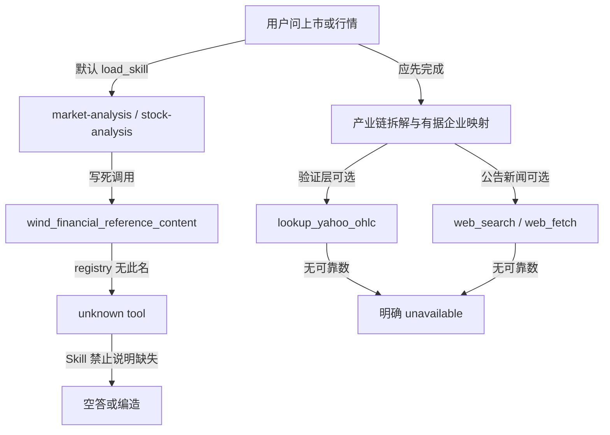

# ChemClaw 去掉 Wind 调用路径（最小 P0）

> 当前状态：D-144 已落地；下一刀须独立授权。本次只做金融 Skill 断路修复，不碰 Fast Router / 合集 P0 / 安装包。
> 任务边界：Skill 文案 + 已安装副本热刷新 + 防回归测试 + D-145。不新建行情 Provider。
> 已拍板：调查确认 **没有可用 Wind 工具**。这不是「降级为可选增强」，而是 **不能用**。Skill / Persona / 测试中删除一切对该工具的调用与 if-present 分支。
> 验收：bundled 三份金融 Skill **不再出现** `wind_financial_reference_content`；`build_engine` 无 Wind 仍注册 Yahoo/Web；chain-lobster 主流程不把不存在的金融 Provider 当单点；缺指标写 unavailable。
> 预计修改：约 8 个文件，无新 Python 包。

## Root Cause

产业链龙虾主链路（拆层 / 稀缺 / 证据 / `chem-price-daily` / PubChem / MCP）**不依赖 Wind**。断路发生在延伸到上市标的时：默认挂载 [`market-analysis`](coworker/skills/bundled/market-analysis/SKILL.md) / [`stock-analysis`](coworker/skills/bundled/stock-analysis/SKILL.md)（另有同构的 [`macro-analysis`](coworker/skills/bundled/macro-analysis/SKILL.md)）把 **从未注册** 的 `wind_financial_reference_content` 写成唯一语料源。

运行时证据：

- 全仓 Python **零** `wind_` 符号；[`build_engine()`](coworker/agent.py) 不注册任何 Wind 工具。
- 模型若仍调用该名，[`TurnEngine`](coworker/engine.py) 返回 `unknown tool: wind_financial_reference_content`。
- Skill 同时规定「所有分析必须来自 Wind」且「严禁写工具未返回 / 受数据限制」——模型被锁进：空答、编造、或死循环改 query。

这不是缺一个商业数据源，而是 **Skill 强制调用运行时不存在的工具**。



## Current Runtime Tool Availability

以 [`coworker/agent.py` `build_engine()`](coworker/agent.py) 实际 `registry.register*` 为准（另加 `agent.build_tools` 与 MCP `extra_tools`）。

**已注册、本 P0 应复用的金融/Web：**

- `lookup_yahoo_ohlc` — [`coworker/yahoo_finance/tool.py`](coworker/yahoo_finance/tool.py)；非官方 Yahoo Chart；参数 `symbol` / `range` / `interval`；失败返回 `status=error` + 空 OHLC，**不编造**。
- `web_search` — 默认 DuckDuckGo；标题/URL/snippet。
- `web_fetch` — 单页可读文本，约 20k 字。
- `lookup_fx_rate` — 仅换算用户已给金额，不是行情库。

**已注册、本 P0 不得改用途：**

- `lookup_chemical_identity`（PubChem）
- 化工社 / GLEIF / VAT / Wikipedia / TED / SAM / Comtrade / 海关 CSV / 报价与名单工具
- MCP `extra_tools`（如已配 chem-data-hub 的 `get_price_trend`）— 继续服务化工现货，**禁止用 Yahoo 替代**

**未注册、本 P0 从 Skill 中删除（不要写调用，也不要写「若出现则可调用」）：**

- `wind_financial_reference_content` 及任何 `wind_*` — ChemClaw 当前没有该工具，**不是可选 Provider**
- `lookup_cn_stock` 等未来 CN Market 工具 — 只作为 P1 扩展点写在决策文档，不写进 Skill 调用列表，避免模型去调不存在的名字

Yahoo 代码约定（只写进 Skill，不改 Provider）：A 股用 `{代码}.SS`（沪/科创）或 `{代码}.SZ`（深），**不要用 `.SH`**；指数例 `^SSEC` / `^HSI` / `^GSPC`。失败则 OHLC = unavailable。

## Wind References Found

- [`coworker/skills/bundled/market-analysis/SKILL.md`](coworker/skills/bundled/market-analysis/SKILL.md)：hard-require（「仅使用」「必须来自」「优先调用」）— **删除全部 Wind 工具名**
- [`coworker/skills/bundled/stock-analysis/SKILL.md`](coworker/skills/bundled/stock-analysis/SKILL.md)：同上
- [`coworker/skills/bundled/macro-analysis/SKILL.md`](coworker/skills/bundled/macro-analysis/SKILL.md)：同上；**非** chain-lobster 默认 skills，但是同一 Serenity 金融三件套
- `tests/`、`docs/`、`coworker/**/*.py`：**无** `wind_financial_reference_content`

**同构但本次不改：** [`chem-price-daily/SKILL.md`](coworker/skills/bundled/chem-price-daily/SKILL.md) 强制 chem-data-hub `get_price_trend`——那是已接线的 MCP，不是幽灵工具。

**安装态陷阱：** [`seed_bundled_skills()`](coworker/skills/bootstrap.py) 仅在目标目录没有 `SKILL.md` 时拷贝。已启动过的 `%APPDATA%\ChemClaw\skills` **不会**因改 bundled 而更新。P0 必须做窄刷新，否则本机仍走旧 Wind 文案。

**预存测试漂移：** [`tests/test_chain_lobster.py`](tests/test_chain_lobster.py) 的 expected skills **漏了** frontmatter 里已有的 `chem-price-daily`（D-078）。改 persona 测试时一并对齐。

## Broken Execution Paths

1. 产业链龙虾问「万华化学 / 上市标的」→ `load_skill(stock-analysis)` → 强制 Wind → unknown tool。
2. 「分析今天 A 股」→ `load_skill(market-analysis)` → 同上。
3. 用户手动 `/macro-analysis` → 同上。
4. 即使产业链段已完成，Skill 仍可能把后续金融验证卡死。

## Proposed P0 Changes

原则：当前 **没有 Wind，不能调用 Wind**（不是 optional）。只调用已注册工具（`lookup_yahoo_ohlc`、`web_search`、`web_fetch` 等）；Web 是公开证据，不是结构化行情库；精确指标无来源 → 写明 unavailable，禁止猜测。禁止在 Skill 里保留 `wind_financial_reference_content` 字样或「若工具列表里有 Wind 则优先」分支。

### 1. 三份金融 Skill（含 macro，同一补丁类）

重写取数/输出规范，保留主题边界与篇幅上限。

统一数据分层（写入三份 `SKILL.md`）：

1. **当前已注册的第一方结构化工具**：现为 `lookup_yahoo_ohlc`（指数/个股/期货 OHLC）。
2. **`web_search` / `web_fetch`**：公告、交易所、公司官网、权威新闻、IR/互动；数字必须能指回所抓页面，禁止用摘要「估」出 PE/PB/北向/龙虎榜/成交额。
3. **unavailable**：无可靠来源则明确写出「当前无可靠结构化来源」，禁止编造。删除旧规则「取不到就省略 / 严禁受数据限制」。
4. **删除** 一切 Wind 工具说明、调用示例、query 表、以及「仅使用 / 必须来自 / 优先调用 Wind」。

**market-analysis 主题映射：**

- 全球/指数/盘面走势：Yahoo 指数或代表性标的 OHLC；有序列则按既有 ```chart` short-ref（`from_tool`+`symbol`），禁止手抄 OHLC。
- 盘前/盘中/盘后综述：Yahoo 事实 + Web 事件；区分事实 / 媒体观点 / 推断。
- 新股/再融资/情绪：Web 公开报道；无来源不编「机构情绪指标」。
- 龙虎榜 / 大宗 / 沪深港通精确数：当前无结构化工具 → unavailable；可用 Web 作背景，但不得把网页语气伪装成结构化金融数据库。

**stock-analysis 维度映射：**

- 技术/行情：`lookup_yahoo_ohlc`；失败则无均线/成交量/走势数字。
- 基本面/财务：年报季报公告官网（Web）；禁止凭记忆填报表。
- 重大事件/异动/IR：`web_search`+`web_fetch`；无来源不得写「据机构观点」「据管理层公开表态」。
- 同业比较：只比较有来源的字段；缺的标 unavailable。
- 化工现货：仍走 `chem-price-daily` / chem-data-hub，不用 Yahoo。

**macro-analysis：** 同样去掉 Wind-only；宏观用 Web 公开统计/央行/官方公报；汇率换算可用 `lookup_fx_rate`（不编即期中间价序列）；没有的宏观精确序列标 unavailable。

禁止把整份 Skill 改成「只用 Web」。

### 2. [`coworker/personas/builtin/chain-lobster.md`](coworker/personas/builtin/chain-lobster.md)

保留默认 `market-analysis` / `stock-analysis`。在「标的是延伸」段追加：

- 金融是产业链结论的**验证层**，不是主流程单点。
- 当前没有万得等商业金融库；仍须完成：拆链 → 稀缺 → 有据企业映射。
- 用户要行情/财务时再 `load_skill`；只用已注册工具（Yahoo OHLC + Web）；缺指标写 unavailable。
- 化工现货与股价分源（MCP vs Yahoo）。
- 不要写「若有 Wind 则用 Wind」。

### 3. 已安装 Skill 窄刷新（否则 P0 对现网无效）

在 [`coworker/skills/bootstrap.py`](coworker/skills/bootstrap.py) 新增 `refresh_finance_skills_without_wind()`：

- 白名单：`market-analysis` / `stock-analysis` / `macro-analysis`
- 仅当已安装 `SKILL.md` 仍含 `wind_financial_reference_content`（任意出现，不限于 hard-require 句式）时，用 bundled 覆盖 **该 SKILL.md**（不整树、不动用户删掉的 `uninstalled_bundled`）
- [`coworker/server/manager.py`](coworker/server/manager.py) 在 `seed_bundled_skills` + `sync_managed_lexicon` 之后调用
- 导出 [`coworker/skills/__init__.py`](coworker/skills/__init__.py)

不引入通用 bundled 覆盖（避免违反 D-026 用户改稿）。

### 4. 极小投影补丁（非 Fast Router）

[`coworker/tool_projection.py`](coworker/tool_projection.py) 的 Yahoo 关键词补上 `A股|港股|美股|大盘|上证|深证|恒生`，避免「分析今天 A 股」在 projection ON 时只留下 web、看不到 `lookup_yahoo_ohlc`。不改路由开关。

### 5. [`coworker/agent.py`](coworker/agent.py) 扩展点（注释 only）

在 `make_lookup_yahoo_ohlc_tool()` 注册处加注释：未来 `coworker/cn_market/` 的 `lookup_cn_*` 在此注册；本滴不落地。**不**注册 Wind，也**不**加全局 Wind 附录。

### 6. 文档

- [`docs/chemclaw/DECISIONS.md`](docs/chemclaw/DECISIONS.md) 追加 **D-145**：ChemClaw 当前 **没有** Wind 工具，金融 Skill **不得**调用或提及 `wind_financial_reference_content`；按类型使用已注册工具（Yahoo OHLC + Web）；Web 非结构化库；缺值 unavailable；国内结构化行情留给未来 `cn_market` 另案；不把 AKShare 打进核心依赖。
- [`docs/chemclaw/README.md`](docs/chemclaw/README.md) 顶栏状态一条。
- 执行时写入 `docs/superpowers/plans/2026-08-18-chemclaw-remove-wind-finance-path.md`（本 Plan 的落地副本）。

**不改：** [`coworker/yahoo_finance/`](coworker/yahoo_finance/)、[`coworker/chem/tool.py`](coworker/chem/tool.py)、chem-price-daily、不新建 `coworker/cn_market/`。

## P1 Extension Point（本次只预留，不实现）

目标形态（写入 D-145，不建空包）：

```text
coworker/cn_market/  →  对标 coworker/chem/ 与 coworker/yahoo_finance/
对外约 6 个高层 Tool：lookup_cn_stock / financials / market_events / sector / futures / trade_calendar
底层 Provider 另议（AKShare vs 自研 httpx）；ChemClaw requires-python >=3.10，P1 再做兼容性评估
```

P0 **不**在 Skill 里预写 `lookup_cn_*` 调用名（避免又变成幽灵工具）。P1 落地 Provider 并在 `build_engine` 注册后，再改 Skill 取数列表。

## Tests

新文件 [`tests/test_finance_skill_no_wind.py`](tests/test_finance_skill_no_wind.py)（静态 + bootstrap，**不**跑 LLM）：

1. 扫描 `coworker/skills/bundled/**/SKILL.md` 与 `coworker/personas/builtin/chain-lobster.md`：**不得出现** `wind_financial_reference_content`（比 hard-require 更严：连可选/if-present 也不留）。
2. `market-analysis` / `stock-analysis` 必须出现 `lookup_yahoo_ohlc`、`web_search`、`web_fetch`、以及 unavailable/无可靠结构化来源；不得把 Web 写成唯一金融库。
3. `chain-lobster.md` 必须出现验证层/不因商业金融库缺失中断的表述。
4. `build_engine(chat)`：`lookup_yahoo_ohlc`、`web_search`、`web_fetch` ∈ names；`wind_financial_reference_content` ∉ names。
5. 把旧 Wind 文案 seed 进 tmp SkillStore 后调用 refresh → 已安装文件不再含该工具名，且含 Yahoo/Web。
6. 用户已 `uninstalled_bundled` 的技能不被 refresh 回种。

同步：

- [`tests/test_chain_lobster.py`](tests/test_chain_lobster.py)：expected skills 补 `chem-price-daily`；断言新验证层句子。
- [`tests/test_skill_bootstrap.py`](tests/test_skill_bootstrap.py) 或上述新文件：refresh 用例。
- 若有现成 projection 单测，补一条「A股」→ 含 `lookup_yahoo_ohlc`。

执行：

```text
python -m pytest tests/test_finance_skill_no_wind.py tests/test_chain_lobster.py tests/test_skill_bootstrap.py tests/test_yahoo_ohlc.py tests/test_skills.py::test_build_engine_chat tests/test_tool_projection.py -q
```

（Windows 按 TESTING.md 使用独立 `--basetemp`。）

无法用单测保证的（手工、非本刀门禁）：真实对话「万华化学基本面」「今天 A 股」「MDI 产业链+上市公司」不编造北向/龙虎榜。

## Risks

- 无 Wind 后 龙虎榜/北向/精确财务 会大量 unavailable，答案变「薄」——这是正确行为。
- 模型仍可能用参数记忆填 PE；Skill 禁止但无法硬拦。
- Yahoo 对 A 股/指数在大陆网络可能失败 → 必须走 unavailable，禁止改 Web 冒充 OHLC。
- 窄刷新会覆盖「改过但仍含 `wind_financial_reference_content`」的本地 SKILL.md；已删干净该工具名的自定义稿不动。
- 改 Skill 文案不能单独修复已 seed 的旧副本——故 refresh 为 P0 必做，不是可选。

## Out of Scope

- 完整 `coworker/cn_market/`、35 个金融 API、AKShare 入核心依赖
- 新造 OHLC 工具或改 Yahoo HTTP 实现
- 把 Wind 换成「只用 Web」，或把 Wind 留成 if-present 可选分支
- 接入 / 注册任何 Wind SDK、MCP 或假工具 stub
- 改 chem-price-daily / PubChem / 化工社
- Fast Router / 性能开关 / 合集 P0
- LLM 端到端、打安装包、通用 bundled 热更新框架、全量 Skill 幽灵工具扫描器

## Execution Order

1. 先写失败测试（bundled Skill/Persona 不得出现 `wind_financial_reference_content` + registry 无该名 + Yahoo/Web 关键字）。
2. 重写三份 SKILL.md + chain-lobster 验证层句子。
3. bootstrap refresh + manager 调用 + 导出。
4. tool_projection 关键词一行。
5. agent.py 注释；D-145 + README。
6. 跑上面 pytest；记录实结果。
7. 用户点名后再提交。
