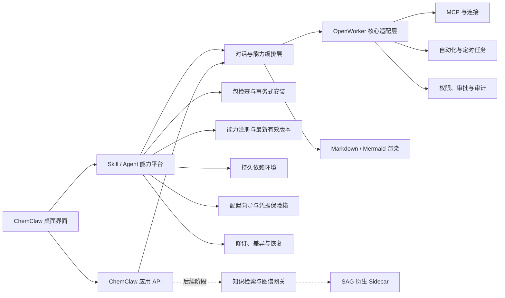
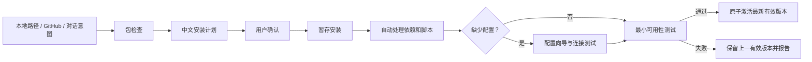
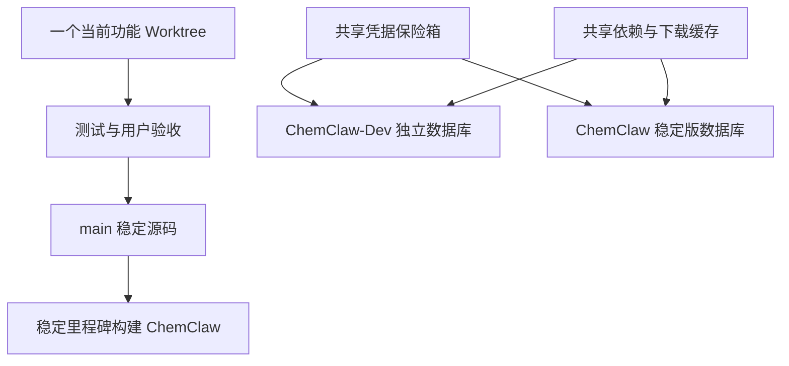
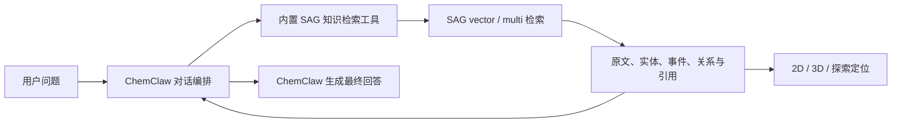

# ChemClaw 产品与技术设计

- 日期：2026-07-29
- 状态：对话设计已批准，书面规格等待用户复核
- 总体路线：基于 OpenWorker 的渐进式模块化升级
- 当前实现状态：仅规划和文档，未修改业务代码

## 1. 背景

ChemClaw 是芯化和云计划构建的 Windows、本地优先、单用户 AI 桌面产品。基础源码为：

- OpenWorker：`D:\OpenWorker\openworker`
- UI 参考：`C:\Users\EDY\Nutstore\1\我的坚果云\芯化和云\上下文工作区\ChemClaw应用界面demo.html`
- SAG 本地参考：`D:\SAG升级ChemClaw\SAG-main-V2`
- SAG 上游：<https://github.com/Zleap-AI/SAG/tree/main>
- Serenity 样板能力包：`C:\Users\EDY\Desktop\serenity-full-package`

用户不是程序员，Codex 将承担主要工程工作。项目必须适应有限 Token 预算、高频源码修改和跨对话长期协作，因此设计先于实现，工作按可独立验收的小里程碑推进，所有事实沉淀到 Git 跟踪文档。

OpenWorker 与 SAG 都采用 MIT 许可证。ChemClaw 可以修改和组合相关代码，但发布时必须保留要求的版权和许可通知。

## 2. 目标

### 2.1 V1 目标

- 产品外观与名称全面成为芯化和云 ChemClaw。
- 默认简体中文，支持切换英文。
- 保留 OpenWorker 的对话、MCP、权限、审批和定时任务能力。
- 提供真实可用的技能、专家龙虾、定时任务、连接和设置页面。
- 支持从本地目录或 GitHub 安装 Skill/Agent 能力包。
- 支持在对话中用一句话触发同一安装流程。
- 安装器自动处理包识别、依赖、脚本、配置、测试、激活和失败回退。
- 点击 Skill/Agent 后进入新对话并显示挂载项，用户不需要知道斜杠菜单。
- Skill/Agent 可编辑、有修订历史、可比较和恢复。
- 对话与 Markdown 报告真实渲染 Mermaid。
- 以“白毛股神 Serenity + 七个核心中文投研 Skills”作为成熟能力包样板。

### 2.2 后续目标

- 保留 SAG 的结构化索引、向量/多跳检索、原文引用和知识图谱能力。
- 提供 JSON/TGZ/PostgreSQL dump 导入恢复与完整备份。
- 提供 2D、3D 和对话+2D 探索模式。
- 构建双链化工百科、确定性标准产业链图和有数据来源的交互价格图。

## 3. 非目标

- V1 不建设多租户、账号、订阅、支付、积分、推荐奖励或云市场。
- 永远不实现 UI Demo 的“数据底座”页面。
- V1 不接入 SAG 图谱。
- 不采用 SAG 原有 Agent 对话系统。
- 不整体重写 OpenWorker 后端或前端。
- 不把 SAG Next.js/React 19 应用嵌入 ChemClaw。
- 不为每次源码修改构建 EXE。
- 当前刚克隆的 OpenWorker 没有用户数据，V1 不做旧数据迁移。
- 阶段五的具体 Wiki 布局、标准图表现形式和价格图交互在其专属设计阶段确定；当前只固定数据与产品原则。

## 4. 方案选择

### 4.1 采用：渐进式模块化升级

保留 OpenWorker 已验证的 Python/FastAPI、React/Vite、Tauri、MCP、权限和自动化核心，在其周围建立 ChemClaw 产品外壳和独立能力平台。只在功能触及的旧代码处建立接口或做针对性拆分。

优点：

- 最大程度保留现有能力。
- 改动可拆分、可测试、可回退。
- 适合有限 Token 和长期多对话协作。
- 可以选择性吸收 OpenWorker 上游修复。

代价：

- 初期需要为部分大型旧文件建立稳定适配层。
- 内部包名和遗留结构会在一段时间内继续存在。

### 4.2 未采用：重做整个前端

按照概念 UI 重写全部页面会快速得到外观，但会一次性制造大量与真实后端不匹配的按钮和接口，回归风险与 Token 成本过高。

### 4.3 未采用：多应用嵌入

把 OpenWorker、SAG 和 ChemClaw 页面作为多个本地应用拼接会产生多套端口、状态、依赖和品牌，不符合“ChemClaw 是唯一产品”的要求。

## 5. 总体架构

### 5.1 ChemClaw 产品外壳

负责品牌、默认中文、英文切换、导航、通用状态和真实页面。UI Demo 只提供视觉参考，不提供业务事实。

第一阶段只替换用户可见品牌。内部 `coworker`、`openworker` 兼容包名可以暂时保留，避免低价值的大规模重命名；这些名称不得泄露到正常产品界面。

### 5.2 对话与能力编排层

负责：

- 当前会话挂载的 Agent、Skills、知识项目和 MCP 范围。
- 明确指定、点击挂载和自然语言自动选择的优先级。
- 把挂载结果和实际版本写入会话运行记录。
- 把 Skill 指令、工具和权限约束组合到 OpenWorker 运行时。
- 让最终回答由 ChemClaw/OpenWorker 模型生成。

### 5.3 OpenWorker 核心适配层

新功能通过稳定接口使用现有对话、MCP、连接、自动化、权限和审批能力，减少 UI 和新领域模块直接依赖大型旧文件。适配层不是复制逻辑，而是为旧能力建立可测试的边界。

### 5.4 Skill/Agent 能力平台

能力平台是一个深模块，对 UI 和对话只暴露少量稳定操作：

- 检查能力包。
- 展示安装计划。
- 安装、配置、测试、激活、更新和卸载。
- 列出可用 Agent/Skills 和状态。
- 创建修订、比较和恢复。
- 为会话解析最新有效版本。

本地目录、GitHub URL、技能页面和一句话安装必须调用同一内核。

### 5.5 知识检索与图谱网关

后续阶段为对话、2D、3D 和探索模式提供统一接口。SAG Sidecar 可修复、升级或替换，而不要求重做 ChemClaw UI 和对话层。

## 6. 技术栈

### 6.1 ChemClaw 主程序

- Windows 桌面：Tauri 2 + Rust。
- 前端：React 18、TypeScript、Vite 5、Tailwind CSS 3。
- 后端：Python 3.10+、FastAPI、Pydantic 2。
- 模型：延续 OpenWorker 的 OpenAI、Anthropic、Gemini、aisuite 和兼容端点。
- 测试：pytest、Vitest、Testing Library、Playwright。
- 新能力元数据：SQLite 和明确的数据库迁移。
- Skill/Agent 文件修订：本地 Git；SQLite 保存状态与索引。
- 国际化：i18next/react-i18next；后端返回稳定错误码和结构化参数。
- Mermaid：官方 Mermaid 包，按需加载并在受限配置中渲染。
- 凭据：保留 `SecretStore` 接口，Windows V1 改用 DPAPI/系统加密能力；环境变量引用继续可用。

### 6.2 Skill 运行环境

- Python、Node 和命令型依赖通过可插拔运行环境提供者管理。
- 运行环境跨对话和重启持久存在。
- Skill 依赖与 ChemClaw 主程序依赖隔离。
- 共享下载缓存避免重复下载。
- 有锁文件时遵循锁文件；没有时记录解析后的实际版本。
- 安装计划内的脚本自动执行；系统级或管理员行为单独确认。

### 6.3 SAG Sidecar

- Python 3.11、FastAPI、SQLAlchemy、zleap-sag。
- 默认本地关系数据和向量存储。
- PostgreSQL/pgvector 只作为旧 `.dump` 恢复兼容组件按需启动。
- 前端图谱阶段再引入 `@xyflow/react`、Three.js 和 `3d-force-graph`。
- 不把 Next.js/React 19 或 SAG 的完整前端依赖树加入 V1。

## 7. 产品信息架构与国际化

### 7.1 V1 一级导航

- 对话
- 技能
- 专家龙虾
- 定时任务
- 连接
- 设置

审批、权限记录、审计和历史作为二级页面保留。图谱未实现前不显示空白图谱入口。

### 7.2 国际化规则

- 首次启动固定使用简体中文，而不是跟随 OpenWorker 现有英文默认。
- 用户选择英文后持久保存。
- 稳定内部 ID 不随语言变化。
- 第一方错误返回错误码和参数，由前端翻译；不得把任意英文异常直接展示给普通用户。
- Agent/Skill 名称与介绍可维护中英文元数据。
- 中文元数据是第一方能力的默认编辑入口，可以生成英文预览。
- 执行正文只维护一份权威内容，不默认自动翻译。
- Agent 默认回答中文；用户明确要求英文或产品语言为英文时使用英文。

### 7.3 真实按钮规则

- 有真实 API 和状态闭环才显示操作按钮。
- 尚未实现的未来功能不以假数据或无效点击占位。
- 不兼容能力不在普通页面出现。
- 待配置能力可以显示，因为用户有可完成的配置路径。

## 8. Skill、Agent 与任务模型

详细术语见 `docs/chemclaw/DOMAIN.md`。

### 8.1 Skill

Skill 可以包含：

- `SKILL.md`
- references
- assets
- scripts
- Python/Node/系统依赖声明
- MCP 或外部服务要求
- 配置字段和可用性测试
- 中英文展示元数据

安装器不能把“存在 `SKILL.md`”等同于“能力可用”。

### 8.2 Agent

Agent 组合：

- 身份和系统行为。
- 默认 Skills。
- 可用工具/MCP。
- 模型偏好。
- 权限策略。
- 中英文名称和介绍。

Agent 引用 Skill 的稳定 ID 和版本策略，不复制 Skill 文件。

### 8.3 任务模板

任务模板组合：

- 提示词或参数化任务。
- Agent 和 Skills。
- 可选知识项目。
- 时间或重复规则。
- 输出位置和通知方式。

加入时间规则并启用后成为定时任务，执行层复用 OpenWorker 自动化引擎。保存前必须支持立即试运行。

### 8.4 Serenity 映射

`C:\Users\EDY\Desktop\serenity-full-package` 映射为：

- Agent：白毛股神 Serenity。
- 七个独立中文投研 Skills：
  - 产业链层级测绘
  - 候选优先级排序
  - 叙事到系统变化
  - 研究对话推进
  - 稀缺环节识别
  - 证伪条件压力测试
  - 证据强弱分级
- Agent 通过引用组合 Skills。
- Windows 兼容资源和脚本归属相应能力。
- Linux/OpenClaw 专用能力跳过且不在普通页面展示。
- 待配置能力通过向导完成。

V1 最终保证上述 Agent、七个 Skills、兼容脚本和 Mermaid 能力可用；首条纵向链路先接通“产业链层级测绘”。

## 9. 安装、配置与生命周期

### 9.1 包检查

执行任何包脚本前识别：

- Agent/Skills/资源结构。
- Python、Node、命令和系统依赖。
- 安装脚本内容与网络下载。
- MCP、环境变量、账号和 API Key。
- 操作系统和架构要求。
- 预计写入目录、权限和外部副作用。

### 9.2 用户确认

中文安装计划清晰列出将安装的能力、依赖、脚本、配置和风险。用户一次确认后，计划内步骤自动完成。出现管理员权限或超出计划的新行为时暂停并再次确认。

### 9.3 原子安装与回退

- 所有内容先进入暂存区。
- 依赖安装失败不污染当前激活环境。
- 通过语法和最小功能测试后原子切换当前指针。
- 失败保留上一有效版本。
- 卸载清理能力指针和专属环境；共享缓存由垃圾回收策略处理。

### 9.4 待配置向导

- Skill 卡显示“待配置”。
- 根据服务商预填主机、端口和安全选项。
- 用户只填写无法自动获得的账号、授权码、API Key 或端点。
- 提供不会持久化错误输入的连接测试。
- 错误以中文说明凭据、网络、权限、端点或服务状态。
- 测试通过后才启用能力。

Serenity 包中明确的示例是 IMAP/SMTP 邮件能力，需要邮件服务、账号和授权码；多搜索引擎能力不需要 API Key，只需要可用网络。Python/Node 包属于自动依赖，不属于用户手动配置。

### 9.5 凭据

- 不进入 Skill/Agent Git 历史。
- 不进入模型上下文、提示、普通日志和默认备份。
- 开发版与稳定版可以在同一 Windows 用户下按稳定连接 ID 引用共享保险箱。
- 凭据状态 API 只返回存在、过期和账号标识等元数据，不返回秘密值。

### 9.6 修订与最新版本

- 保留安装时原始基线。
- 合法编辑自动形成修订。
- 修订覆盖 `SKILL.md`、references、scripts 和 assets。
- UI 提供时间、摘要、差异、恢复上一版本和恢复原始版本。
- 无效修改不激活，继续运行上一有效版本。
- 所有对话的后续轮次使用最新有效版本。
- 历史记录保存当时使用版本用于诊断。
- 恢复旧内容创建新的当前修订。
- Git 上游更新不得静默覆盖本地修改。

## 10. 用户流程

### 10.1 点击 Skill

1. 用户在技能页看到中文名称、介绍、状态和配置要求。
2. 点击“使用”。
3. ChemClaw 新建对话并显示 Skill 挂载标签。
4. 用户直接输入自然语言需求。
5. 后续轮次持续解析最新有效版本。

### 10.2 点击 Agent

1. 用户点击“白毛股神 Serenity”。
2. 新建对话并显示 Agent 标签。
3. Agent 解析它引用的 Skills、工具和 MCP。
4. 缺配置时在执行前提供配置入口。
5. 所有工具调用继续经过 OpenWorker 权限和审批。

### 10.3 一句话安装

示例：

> 安装 `C:\Users\EDY\Desktop\serenity-full-package`

系统识别安装意图，展示包检查结果和中文计划，确认后调用同一安装内核。

### 10.4 自动选择

- 用户明确指定优先。
- 点击挂载具有确定性。
- 自然语言匹配可以推荐或自动挂载，但必须显示原因和标签。
- 多 Skill 组合允许，但全部可见、可移除。

## 11. Markdown 与 Mermaid

- 对话和 ChemClaw Markdown 报告预览共用渲染组件。
- fenced `mermaid` 代码块渲染为图形。
- 提供图形/源码切换。
- 渲染失败保留源码并显示可理解错误。
- 支持 SVG/PNG 导出。
- 使用 Mermaid 安全配置，禁止任意网页脚本。
- 产业链 Skill 可以要求 Mermaid 输出。
- 阶段五标准产业链图由版本化数据和模板生成，不依赖每次对话即时发挥。

## 12. 开发环境、Worktree 与发布

- Worktree 是完整源码检出，不是空环境。
- 普通功能 Worktree 默认复用一个持久 `ChemClaw-Dev` 配置。
- 不为每天的小修改创建新 Worktree。
- 开发与稳定对话、任务和业务数据库分开。
- 共享保险箱和不可变缓存，避免重复输入和下载。
- Skill/Agent 激活指针在开发与稳定环境分开。
- 高风险数据库迁移和安装器测试才使用临时隔离状态。
- 开发使用热更新。
- 用户验收后合并 `main`。
- 稳定里程碑才构建安装程序。

## 13. SAG 检索与图谱

### 13.1 接入边界

保留：

- 文档解析后的事件、实体与关系索引。
- 增量更新。
- 快速向量检索。
- 查询时动态超边与精确多跳检索。
- 跨信源或指定信源检索。
- 原文块、引用、节点展开、时间线和探索记录。
- 通过统一网关供 ChemClaw 内置工具、图谱 UI 和可选 MCP 端点使用。

排除：

- SAG 原有 Agent 对话循环。
- SAG 最终答案合成。
- SAG 存在问题的联网工具调用链。
- 整体 Next.js 前端。

### 13.2 检索模式

- 自动：普通对话默认，根据问题选择策略并显示实际模式。
- 快速：固定 `vector`。
- 深度检索：固定 `multi`。
- 白毛股神 Serenity 和严谨化工研究 Skills 默认深度检索。

精确检索超时或失败时允许按策略回退快速检索，但 UI 和运行记录必须显示降级。知识内容作为不可信数据，不能向 Agent 注入系统级指令或扩大工具权限。

### 13.3 探索与图形

- 2D 用于精确关系分析和对话并列探索。
- 3D 用于全局浏览。
- 对话检索结果可定位图谱。
- 选择图谱节点可成为下一轮对话上下文。
- 图谱故障不影响普通对话、Skill、MCP 和自动化。

## 14. 图谱导入、备份与大数据任务

### 14.1 支持格式

| 格式 | 典型内容 | 处理 |
|---|---|---|
| `.tgz` | 关系数据库、向量索引、上传资料和配置 | 隔离暂存恢复，兼容时直接复用向量 |
| PostgreSQL `.dump` | 旧关系数据和 pgvector | 临时 PostgreSQL/pgvector 恢复器只读检查与迁移 |
| `.json` | 文档、切片、实体、事件和关系 | 结构导入后按需后台向量化 |

完整备份至少包含：

- `manifest.json`
- 可交换的项目数据
- 关系数据库或完整数据快照
- 向量数据/索引
- 原始资料
- 格式版本和引擎版本
- 文件校验值
- 不包含敏感凭据

### 14.2 恢复安全

- 默认恢复为新知识项目。
- 覆盖当前项目需要展示影响、自动安全备份和再次确认。
- 先验证文件完整性、版本、磁盘空间、向量模型和维度。
- 先恢复到暂存项目，验证计数和索引后原子激活。
- 失败保留原项目和原备份。

### 14.3 向量兼容

- 模型、维度和索引格式兼容时直接复用。
- 索引格式不同但向量兼容时只转换索引。
- 查询模型与旧向量空间不兼容时不能混用。
- 不兼容时允许用户配置原模型，或显示数据量、模型与预计成本后重新向量化。
- 默认优先复用，确认无法兼容才重建。

### 14.4 大数据任务

- 流式读取，不一次装入内存。
- 后台分批处理，界面保持可用。
- 限制 CPU、内存、并发和模型 API 消耗。
- 显示阶段、已完成/总量、失败数和预计剩余时间。
- 支持暂停、继续和取消。
- 持久检查点支持应用重启后续跑。
- 批次操作幂等，可安全重试。
- 导入期间其他对话、Skill 和 MCP 可继续使用。

## 15. 阶段五：双链化工百科与标准产业链图

### 15.1 正式设计来源

- `C:\Users\EDY\Nutstore\1\ob\线1_来源路径树_v2.1-蒋老师.md`
- `C:\Users\EDY\Nutstore\1\ob\化学品缩写消歧规则-蒋老师.md`
- `C:\Users\EDY\Nutstore\1\ob\线2_应用去向树_v3.0-蒋老师.md`

已确认的源文档含义：

- 线1：从八类一次原料出发，沿工业生产路径展开 L0–L4，并带稳定分支编码、CAS 和缩写冲突记录。
- 线2/A线：以 GB/T 4754-2017 行业分类为骨架，描述行业、工艺/应用/原料和上游来源。
- 消歧规则：CAS 为首要唯一键；数据库写入、读取、跨源合并和合规安全场景执行强制消歧；上下文不足和安全场景进入人工确认。

### 15.2 产品方向

单纯把完整树做成下拉目录会过深且难以维护。阶段五优先采用：

- 每个化学品/品种一个具有稳定 ID 的百科页。
- 页面之间使用有类型的双向链接。
- 页面可从品种跳转到来源路径、应用行业、上下游、同义词、证据、价格和图谱。
- 目录、搜索和图谱都是同一底层知识的不同视图，不各自维护一份数据。
- 可从线1、线2和消歧规则导入初始结构，但导入结果必须经过验证和修订管理。

Tencent/WeKnora 的 Wiki Mode 提供“互链 Markdown Wiki + Wiki 浏览 + 可视知识图谱”的产品参考：<https://github.com/Tencent/WeKnora>。ChemClaw 当前只借鉴其产品模型；是否复用代码、数据模型或组件必须等阶段五做独立许可证、架构和体积评估。

### 15.3 确定性标准产业链图

- 标准图由结构化、版本化的产业链数据和固定模板生成。
- 同一数据版本与模板必须得到相同结果。
- 图有草稿、审核、发布和废弃状态。
- AI 可以建议关系、生成草稿和解释差异，但不能绕过审核发布。
- 对话引用已发布标准图，而不是每次重新编造一张不同的图。
- Mermaid 可以用于早期草稿和报告输出，但最终交互形式不必局限于 Mermaid。

### 15.4 交互价格图

技术上可实现，但必须满足：

- 数据来自公司内部或外部价格 MCP/API。
- 每个序列绑定稳定品种 ID、单位、地区、规格、来源和时间戳。
- 图表支持时间范围、缩放、悬停、对比和数据来源查看。
- 缺失、修订和不同口径明确标识。
- 是否实时、刷新频率、授权和缓存策略在阶段五规格中决定。

## 16. 错误处理与安全

- API 使用稳定错误码、结构化参数和中文默认文案。
- 安装、导入和恢复是有状态任务，状态可查询。
- 外部服务失败与本地程序错误分开表达。
- 失败操作不激活半成品。
- 权限、审批和审计不能被 Skill/Agent 绕过。
- URL、脚本、仓库和备份输入在执行前验证。
- 凭据、令牌和私密文档片段不得进入普通日志。
- 对真实外部系统的写操作继续经过明确权限。
- 大数据恢复前检查磁盘和版本，覆盖前建立可验证备份。

## 17. 测试与验收策略

### 17.1 每次修改

- 当前模块的单元测试。
- 类型检查或静态检查。
- 与改动直接相关的快速集成测试。

### 17.2 每个小里程碑

- 完整功能流程。
- 对话、MCP、权限和审批回归。
- 安装失败与回退。
- 中英文界面和错误。
- 真实用户路径的 Playwright 测试。

### 17.3 合并与发布

- 合并 `main` 前运行主测试套件。
- 构建安装程序前运行安装、卸载、启动和升级检查。
- 数据结构变更验证升级和回退。
- 只报告实际执行结果，不把未运行测试描述为通过。

### 17.4 首批保护测试

- OpenWorker 原有对话仍工作。
- MCP 可以配置、测试和调用。
- Agent/Skill 不能绕过权限。
- 失败安装不污染有效版本。
- Skill 点击后真实挂载。
- 所有后续轮次解析最新有效版本。
- 默认中文和英文切换正常。
- Mermaid 成功渲染且错误安全降级。

## 18. 长期 Codex 协作

每个新任务：

1. 读取 `AGENTS.md` 和指定文档。
2. 用中文汇报当前阶段、本次目标和不做事项。
3. 一次只执行一个已批准的小里程碑。
4. 修改前记录文件范围、验收标准和回退方式。
5. 在功能 Worktree 中实现。
6. 运行与风险相称的测试。
7. 用户体验验收。
8. 小提交并更新项目控制台。
9. 用户确认后合并稳定分支。

Token 控制：

- 不在每个新对话重新分析整个仓库。
- 只读取当前模块和引用文档。
- 复用本地规格、计划和测试。
- 日志只保留关键错误和结论。
- 高频改动使用热更新。
- 大需求拆成可独立提交和回退的小任务。

## 19. 路线图

### 阶段 0：项目控制基础

- 设计、决策、领域术语和 AGENTS 文档。
- Worktree 与 Git 规则。
- 可复现测试环境和基线。
- 不修改业务功能。

### 阶段 1：首条真实纵向链路

分为独立 Codex 任务：

1. 对话、MCP、权限和前端启动回归基线。
2. ChemClaw 品牌与中英文外壳。
3. Skill/Agent 领域模型和真实技能页面。
4. Serenity 能力包识别与“产业链层级测绘”接入。
5. 点击 Skill、新建对话、可见挂载和最新版本解析。
6. Mermaid 图形、源码、错误降级和导出。
7. 纵向验收，不构建正式安装包。

阶段 1 验收：

- 源码模式显示 ChemClaw，默认中文。
- 现有对话和 MCP 回归通过。
- Serenity 包检查结果正确。
- “产业链层级测绘”可安装、显示并点击使用。
- 新对话显示挂载项，后续轮次持续生效。
- 输出 Mermaid 并真实渲染。
- 失败路径有中文错误且不破坏有效能力。

### 阶段 2：ChemClaw V1 能力平台

- Serenity 其余六个 Skills。
- 通用本地/GitHub/一句话安装。
- 依赖、配置、测试、回退和卸载。
- 编辑与修订历史。
- 专家龙虾、定时任务、连接、设置和审批中文化。
- 完整回归和第一个日常使用安装程序。

### 阶段 3：SAG 知识检索基础

- Sidecar 和统一知识网关。
- `vector`/`multi` 检索与可点击引用。
- JSON/TGZ/dump 恢复。
- 向量兼容和大数据后台任务。
- 完整备份、恢复和回退。

### 阶段 4：2D、3D 与探索模式

- 2D/3D 图谱。
- 对话与图谱联动。
- 检索定位、节点上下文、GPU 和超大图降级。

### 阶段 5：化工产业链专属能力

- 双链百科与稳定化学品 ID。
- 线1来源路径、线2应用去向和缩写消歧规则的数据化。
- 标准产业链图的生成、审核、版本与发布。
- 搜索、目录和图谱视图。
- 价格数据及交互图。

## 20. 设计完成标准

本规格已经固定：

- 产品范围与非目标。
- 总体架构和技术栈。
- Skill/Agent/任务领域模型。
- 安装、配置、修订和会话挂载规则。
- 国际化、Mermaid 和真实按钮规则。
- 开发、Worktree、测试和发布流程。
- SAG 检索、图谱、备份和大数据处理边界。
- 阶段五双链百科和确定性标准产业链图原则。
- 长期 Codex 文档治理与路线图。

书面规格经用户复核后，下一步只为阶段 1 编写实施计划；不会直接跳到业务实现。
