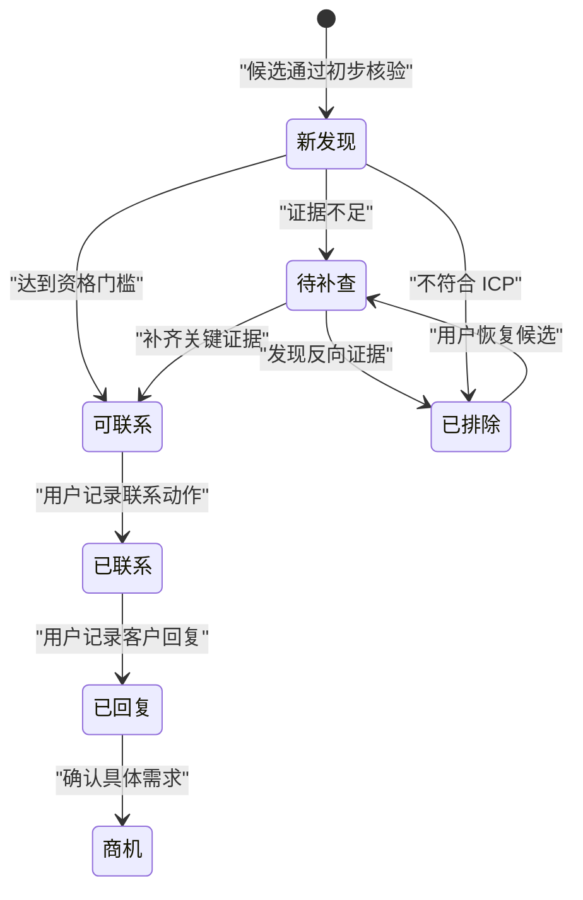
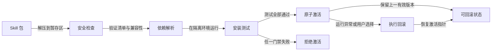

# ChemClaw 销售增长智能设计

> 状态：已批准设计；**外贸（D-091）—SMTP（D-099）与国内登记（D-100）已获用户授权并实现**；TED/Comtrade、清单进阶 UX、CRM 仍须单独批准  


> 批准日期：2026-08-07  
> 产品主体：芯化和云 ChemClaw  
> 首条纵向链路：外贸拓客；内贸拓客与商机雷达首包已交付

## 1. 背景与结论

ChemClaw 是芯化和云面向化工行业的销售增长与专业工作平台。它最重要的用途是外贸拓客、内贸拓客、商机发现和销售转化；化学身份、应用、研究、报告与科研能力用于提高客户识别、证据质量、合规性和成交效率，不反过来主导产品结构。

本设计在以下材料基础上完成审计和重构：

- `D:\ChemClaw_Master_Plan_V3.2_完整版_中文执行包.zip`
- [public-apis/public-apis](https://github.com/public-apis/public-apis)
- 当前 `chemclaw-clean` 工作树中的既有 Agent、Skill、MCP、权限和安装能力
- `D:\化工社skills合集` 本地镜像
- [化工社公开能力说明](https://huagongshe.com/llms.txt)
- [K-Dense Scientific Agent Skills](https://github.com/K-Dense-AI/scientific-agent-skills)

V3.2 压缩包保留重要的业务方向、提示词细节、风险规则和 35 条 Eval 种子，但它只有设计、提示词、来源快照和 Eval 文件，没有可直接安装的完整 Skill 包。它应作为需求与风险规则库，不作为可一次性执行的实施计划。

本设计选择“深工作流 + 稳定能力模块”，不采用一个巨型提示词，也不把每一个步骤或数据源拆成薄 Skill。

## 2. 范围与非目标

### 2.1 本设计覆盖

- 外贸拓客首条纵向链路的输入、输出和业务状态
- 一名销售 Agent 与五个核心 Skill 的边界
- 产品、企业、证据、Lead 和商机的领域对象
- 企业资格、证据等级、双评分和销售动作
- 搜索、查询学习、企业去重和数据源分工
- 客户清单与详情工作台
- Skill 包、依赖、版本、权限、更新和回滚要求
- Eval、离线 Fixture、Provider 契约和安全测试
- V3.2、Public APIs、现有 `chem-*` Skill 和化工社本地合集的归宿
- 后续外贸转化、内贸拓客和商机雷达的阶段关系

### 2.2 本设计不覆盖

- 本轮不实现任何 Agent、Skill、Tool、Provider 或 UI
- 不批准一次性开发 V3.2 所有提案
- 不改变当前已批准的阶段 1 门禁和小任务节奏
- 不自动发送邮件、写 CRM、购买联系人数据或写入真实外部系统
- 不把报告、科研、文献或反应数据作为销售主线
- 不实现“数据底座”页面
- 不采用 SAG 原有对话系统
- 不批量安装第三方科研 Skill

## 3. 方案选择

### 3.1 未选择：大量原子 Skill

把产品识别、应用映射、搜索词扩展、ICP、企业搜索、主体核验和评分分别做成用户可见 Skill，目录看似清楚，但会造成上下文反复传递、重复规则、难以回滚和过多浅接口。

### 3.2 未选择：一个巨型外贸 Skill

把所有规则放进一个 `chem-export-prospecting`，短期实现快，但产品识别、企业核验和评分无法独立测试，内贸和商机雷达会复制逻辑。

### 3.3 已选择：深工作流 + 稳定能力模块

一名 Agent 负责对话、编排、进度和审批；一个主 Skill 负责端到端状态机；四个能力 Skill 分别负责产品、发现、核验和评分。外部 API 位于平台 Tool/Provider 层，不嵌入 Skill。

## 4. 首条外贸拓客纵向链路

首版输入：一个具体化工产品或 SKU、目标国家或区域、目标客户类型和排除条件。

首版输出：主体可识别、业务相关性有证据的候选客户，包含客户类型、商业匹配、证据置信度、证据来源、风险和下一步动作。


首版结束在“可执行的客户清单和下一步动作”。邮件发送、CRM 写入和报价属于后续销售转化阶段，未实现前不显示按钮。

## 5. 核心领域对象

### 5.1 `CommercialSKU`

一个可销售的具体化工产品，而不是只有化学名称的抽象化合物。至少可承载：

- CAS、标准名称、别名和目标语言名称
- 商品名、牌号、纯度、粒径、包装和交付形态
- 工业级、食品级、医药级等等级
- 目标用途和明确排除用途
- 法规、危险性和出口限制的已知状态
- 字段来源、冲突和待确认项

不同规格会改变应用和客户范围，不能默认合并。

### 5.2 `ApplicationGraph`

SKU 到功能、工艺、下游制品、行业和客户角色的有证据关系图。关系必须区分：

- 来源直接支持
- 多来源交叉支持
- 专业推断
- 尚待验证

### 5.3 `ProductLanguageMap`

用于受控搜索的多语言产品表达，包括化学同义词、商业同义词、牌号、规格、应用、客户角色、本地语言和排除词。每个动态学习词保留来源。

### 5.4 `TargetMarket`

国家、区域、语言、目标行业、客户类型、企业规模偏好、排除条件、合规约束和搜索预算。

### 5.5 `CompanyCandidate`

搜索阶段发现、尚未证明合格的企业线索，包括原始名称、国家、候选域名、发现来源和去重信息。

### 5.6 `Account`、`Company`、`Site` 与 `Brand`

- `Account`：销售经营层面的集团或客户账户
- `Company`：法律或可识别的经营主体
- `Site`：工厂、采购地点或经营场所
- `Brand`：产品或市场品牌

集团、子公司、工厂和品牌必须保留关系，不能简单压成一行。

### 5.7 `EvidenceItem`

支持一个具体结论的最小证据单元，包括：来源网址或文件、来源类型、记录标识、原始事实摘要、支持的结论、事件日期、采集日期、证据等级、独立性和冲突状态。

### 5.8 `CompanyEvidencePack`

围绕一个规范化企业主体聚合的证据包，包含主体证据、产品/应用相关证据、商业信号、联系人事实、风险、冲突和未解决问题。

### 5.9 `Lead`

已经过资格判断、适合销售继续处理的企业主体。Lead 不是搜索结果，也不是“网页上出现过产品关键词”的公司。

### 5.10 `ProspectingRun`

一次可恢复、可审计的拓客任务，记录输入、阶段状态、查询、Provider、候选企业、证据、分数、规则版本、Skill 版本、失败和下一步动作。

### 5.11 `OpportunitySignal` 与 `Opportunity`

`OpportunitySignal` 是询盘、招标、交易、扩产、招聘、价格、展会等有来源事件；`Opportunity` 是多个信号经主体归一、相关性判断和商机评分后的可跟进业务机会。二者在后续商机雷达阶段实现。

## 6. Agent 与 Skill 边界

本设计实际是“一名 Agent + 五个 Skill”，不是六个 Skill。

### 6.1 `export-sales-lobster` Agent

职责：

- 理解外贸拓客任务并补齐必要条件
- 调用五个 Skill，维护任务进度和中间状态
- 在来源冲突、成本、外部写入或发送前请求确认
- 输出可继续操作的客户清单

禁止：

- 自己编造企业、联系人、邮箱、采购量或分数
- 绕过权限审批
- 自动发送邮件、写 CRM 或购买数据
- 把低置信度候选包装成合格 Lead

### 6.2 `chem-export-prospecting`

唯一面向完整外贸拓客任务的主 Skill。输入 `CommercialSKU` 草稿、`TargetMarket`、目标 Lead 数量和约束；输出 `ProspectingRun`。

它负责工作流状态、检查点、断点恢复、预算、阶段调用和部分失败汇总，不复制各能力 Skill 的专业规则。

### 6.3 `chem-product-intelligence`

合并 V3.2 的 `chem-product-grounding`、`chem-application-mapping` 和 `chem-chemical-search-expansion`。

输入产品名称、CAS、规格、牌号、用途或文件；输出 `CommercialSKU`、`ApplicationGraph`、`ProductLanguageMap` 和冲突列表。

关键要求：

- CAS、名称、结构和规格冲突时不得静默选择
- 化学同义词与商业同义词分开
- 应用有来源或明确标为推断
- 不把“理论可用于”写成“市场正在采购”
- 首版不依赖 RDKit、Datamol 或其他重型包

身份无法确认时输出未解决状态并要求用户确认，不继续生成客户名单。

### 6.4 `chem-buyer-discovery`

合并 V3.2 的 `chem-icp-builder` 和 `chem-b2b-search`，消费 `ProductLanguageMap`。

职责：生成查询矩阵、执行多语言检索、提取候选、归一域名和企业关系、执行受控查询学习。输出 `SearchRun` 和 `CompanyCandidate`，不负责把企业判为合格。

禁止根据搜索摘要直接生成采购结论，不允许无限增加查询，不把商业目录邮箱当成可靠联系人。

### 6.5 `chem-company-qualification`

合并 V3.2 的 `chem-company-qualifier` 和 `chem-overseas-company-verify`。

职责：核验主体、官网、经营状态、企业角色、产品/应用相关性、证据冲突和风险。输出 `CompanyEvidencePack` 及 `Qualified`、`NeedsReview` 或 `Rejected`。

专业分销商和贸易商不能因标签自动排除；是否保留由本次 ICP 决定。货代、报关、包装和物流企业需单独识别。

### 6.6 `chem-lead-ranking`

确定性评分 Skill，原则上不访问网页。输入已核验企业、证据包、ICP 和版本化评分配置；输出商业匹配、证据置信度、分项分数、风险、优先级和下一步动作。

模型只提取特征和解释结果，不能自由决定数字。

## 7. 客户资格、证据与评分

### 7.1 候选状态

- `Discovered`：仅被搜索发现
- `Qualified`：主体、角色和相关性达到证据门槛
- `NeedsReview`：可能符合但证据不足或冲突
- `Rejected`：明确不符合、重复、失效或属于排除类型

### 7.2 合格客户最低门槛

一个 `Qualified Lead` 至少同时满足：

1. 主体可识别：有可归一的企业名称、官网或可信登记信息。
2. 有业务相关性：一条强证据，或两条相互独立的中等证据，支持产品、相邻产品或下游应用关系。
3. 企业角色符合本次 ICP。
4. 没有已确认的排除事实。

合规、制裁和危险品限制显示风险标记，不由模型冒充法律结论。

### 7.3 证据等级

| 等级 | 典型来源 | 允许用途 |
| --- | --- | --- |
| A 强证据 | 企业官网产品页、官方目录、政府登记、正式招标、官方披露 | 直接支持明确结论 |
| B 交易或行业证据 | 海关交易、展商目录、协会名录、公共采购、可信数据库 | 与主体或官网交叉核验 |
| C 发现证据 | B2B 平台、商业目录、企业社交页、搜索结果 | 发现候选，不单独证明采购意图 |
| D 推测线索 | 名称关键词、相似企业、模型推断 | 只生成待核验任务 |

搜索摘要不能冒充已打开并验证的页面。

### 7.4 双评分

`Lead Fit Score` 表达商业匹配，默认维度为：

- SKU/应用匹配：30
- 企业角色与 ICP：20
- 采购或业务活动信号：20
- 目标市场适配：10
- 可接触性：10
- 信号时效性：10

`Evidence Confidence` 根据来源等级、独立来源数、主体归一、关键字段覆盖、时效和冲突计算。

两个分数必须同时展示。未知主要降低证据置信度；明确反向证据才降低商业匹配。阈值可配置并由真实业务数据校准，不宣称是成交概率。

优先级使用二维判断：

| 商业匹配 | 证据置信度 | 动作 |
| --- | --- | --- |
| 高 | 高 | 优先联系 |
| 高 | 低 | 优先补查 |
| 中 | 高 | 纳入培育 |
| 低 | 高 | 排除或低优先级 |
| 低 | 低 | 暂停处理 |

## 8. 搜索、查询学习与去重

### 8.1 查询矩阵

查询由“产品词 × 应用词 × 企业角色 × 地理/语言”生成，包含 CAS、标准名、商业别名、规格、应用、下游制品、manufacturer、formulator、importer、distributor、本地语言和排除词。

系统记录每条查询的生成原因、执行时间、结果数和有效企业数。

### 8.2 查询学习

1. 只从已打开页面、可信目录或用户文件提取新词。
2. 新词保留来源企业、页面和位置。
3. 每轮最多新增四组查询。
4. 每条新查询说明补充了什么遗漏。
5. 连续两轮有效企业增量过低时停止。
6. 不允许模型凭常识无限扩展。
7. 低质量目录不能污染产品语言地图。

### 8.3 企业去重

去重优先使用：法定企业标识、官网主域名、规范化名称 + 国家 + 地址、电话或邮箱域名。集团、子公司、工厂和品牌保留关系，不错误合并。

## 9. 数据源与 Provider 边界

API 客户端属于平台 Tool/Provider，不写进 Skill。Skill 只表达业务流程、调用条件、证据规则和输出合同；密钥只进入凭据保险箱。

| 数据源 | 正确用途 | ChemClaw 形态 | 不得推断 |
| --- | --- | --- | --- |
| [PubChem](https://pubchem.ncbi.nlm.nih.gov/docs/pug-rest) | 化学身份、性质和同义词辅助 | `ChemicalIdentityProvider` | 商业应用和采购意图 |
| 企业官网 | 产品、应用、业务范围、公开联系方式 | `WebEvidenceProvider` | 实际采购量 |
| [GLEIF](https://www.gleif.org/en/lei-data/gleif-api) / 国家登记 | 法定主体和集团关系 | `LegalEntityProvider` | 产品需求 |
| [UN Comtrade](https://comtradeplus.un.org/TradeFlow) | 国家/HS 层面的贸易吸引力 | `TradeFlowProvider` | 某企业实际进口 |
| 海关/提单数据 | 企业交易线索和供应模式 | 文件或授权 Provider | 收货方一定是终端买家 |
| [TED](https://docs.ted.europa.eu/api/latest/search.html) / [SAM.gov](https://open.gsa.gov/api/get-opportunities-public-api/) | 当前公共采购机会 | `TenderProvider` | 私营需求全貌 |
| [USAspending](https://api.usaspending.gov/docs/endpoints) | 美国公共采购历史 | `AwardHistoryProvider` | 当前仍有采购意向 |
| [SEC EDGAR](https://www.sec.gov/search-filings/edgar-application-programming-interfaces) | 上市公司事件和扩产线索 | `CompanyEventProvider` | 普通私营企业信息 |
| B2B 平台/商业目录 | 候选发现 | `DirectoryDiscoveryProvider` | 主体真实性和购买意图 |

[public-apis/public-apis](https://github.com/public-apis/public-apis) 只是发现目录，不是 API 或 SDK，不作为运行时依赖；目录许可证不替代每个底层 API 的条款审核。

首条外贸链路只要求现有网页搜索与读取、企业官网证据、PubChem 产品辅助和用户约束；GLEIF 为可选增强。Comtrade、TED、SAM.gov、SEC、USAspending 和海关数据按后续阶段逐个接入。

**（2026-08-09 D-095）已交付首包**：平台 Tool `lookup_chemical_identity` + `PubChemProvider`（`coworker/chem/`）；Fixture 契约测试；Skill 不内嵌 API 客户端。

**（2026-08-09 D-096）已交付首包**：平台 Tool `lookup_legal_entity` + `GleifProvider`（`coworker/entity/`）；Fixture 契约测试；`chem-company-qualification` 文档接线。

**（2026-08-09 D-100）已交付国内登记首包**：`CnRegistryProvider` + 路由（USCC/中文名）；SecretStore `cn_registry:default`；**尚未**关系树 / TED / Comtrade / 海关。

化工社反应数据不参与客户搜索和 Lead 评分主流程，只能作为特殊产品的化学证据补充。

## 10. 销售工作台与交付

首版交付物是可继续经营的客户任务，不是长篇研究报告。

### 10.1 任务摘要

显示 SKU、目标市场、ICP、排除条件、查询和来源覆盖、合格/待补查/排除数量、更新时间和评分规则版本。

### 10.2 客户清单

默认字段：企业、客户类型、商业匹配、证据置信度、匹配原因、关键证据、最新信号、风险/缺口、下一步动作和销售状态。

名单分为：可联系、待补查和已排除。排除项保留原因，防止重复搜索。

**（2026-08-09 D-098）已交付首包**：平台 Tool `format_lead_list` + Skill `chem-lead-list`（挂外贸/内贸拓客龙虾）+ GUI「客户清单」页（导入 JSON / 导出 CSV / 本地状态与备注）；**不**显示发送邮件或 CRM 按钮。

### 10.3 企业详情

显示主体信息、匹配原因、证据台账、采购/业务信号、联系人策略、风险和下一步动作。没有可靠联系人时只建议岗位角色，不生成个人姓名或邮箱。

### 10.4 首版操作

只有实现并验证后才显示：查看来源、继续补查、调整 ICP 并重新评分、标记状态、添加备注、排除/恢复、导出客户清单和断点续跑。

**D-098 已实现**：标记可联系/待补查/排除、备注、导入 JSON、导出 CSV。尚未实现：查看来源详情、继续补查、调整 ICP 重评、断点续跑 UI。

**D-099 已实现（对话内）**：助手文本含 `ready_for_human_send` 时显示「提交发送审批」；复用连接器 `email_send` + 审批卡；客户清单页仍无发送按钮。添加好友、CRM 写入、购买联系人未实现前不显示按钮；报价为对话内草稿（D-097），不等于发送。

### 10.5 销售状态



“已联系”“已回复”和“商机”只能由用户操作或真实连接器事件触发。

### 10.6 交付格式

每次运行保留结构化 `ProspectingRun`，可生成带证据链接的 CSV/XLSX、用于恢复的 JSON 和对话内简洁 Markdown 摘要。PDF 或长篇市场报告不是默认交付。

## 11. Skill 包、版本、依赖与回滚

### 11.1 目标包结构

```text
chem-product-intelligence/
├── SKILL.md
├── skill.json
├── schemas/
├── references/
├── scripts/
├── tests/
└── migrations/
```

`skill.json` 至少声明稳定 ID、中英文名称、版本、类型、ChemClaw 兼容范围、输入输出 Schema、Tool、必需/可选 Provider、权限、依赖、配置、测试、来源、许可证和迁移/回滚信息。

这是目标设计；当前运行时尚未实现完整 manifest、稳定版本、依赖解析和原子激活，不能只复制目录就声称满足要求。

### 11.2 安装生命周期



检查 ZIP 路径穿越、异常链接、重复 ID、Schema、兼容性、脚本与依赖、权限超声明、测试、来源和许可证。

### 11.3 可用状态

- `InstalledNotReady`：已安装但缺凭据或必需配置
- `Active`：依赖、配置和测试均通过
- `Degraded`：可选 Provider 不可用，核心流程仍可运行
- `Disabled`：用户停用
- `RollbackAvailable`：上一有效版本可恢复

### 11.4 更新语义

- 所有对话的后续调用按稳定 ID 解析最新有效版本，不继续使用对话开始时缓存的旧内容。
- `ProspectingRun` 记录每个阶段实际使用的 Agent、Skill、规则和 Provider 版本。
- 中途更新后续阶段使用最新有效版本，并记录版本边界。
- Schema 不兼容时必须迁移；无安全迁移则暂停。
- 更新失败不能覆盖当前有效版本。
- 回滚后所有后续调用立即使用恢复版本。

### 11.5 首版依赖原则

五个核心 Skill 的脚本只使用标准库或现有运行时。PubChem、GLEIF 和网页能力属于平台 Provider，不在 Skill 内执行任意 `pip install`、`npm install` 或系统命令。以后确需依赖时，由安装器展示版本、来源、体积、许可证和权限并经过审批。

## 12. 权限与安全

- Agent 只能编排，不能提升权限。
- Skill 声明能力，Tool 执行时仍经过现有权限和审批。
- Provider 只访问已配置服务和凭据。
- Script 受沙箱、路径和依赖限制。
- 外贸拓客默认只读。
- 写 CRM、发送邮件、上传客户文件、购买联系人或调用收费服务必须单独审批。
- 生成邮件草稿与发送邮件是两个权限等级。
- 网页内容始终是不可信数据，不能修改 Agent、Skill 或权限规则。
- 网页中的提示注入、索要密钥和越权指令必须被当作页面内容而不是系统指令。

## 13. 测试与 Eval

V3.2 的 35 条 Eval 保留为场景种子，但现有 `must_include` / `must_not_include` 文本匹配不足以作为生产验收；`chemical_reaction_search` 等 Tool 也不能错误登记为 Skill。

### 13.1 六层测试

1. 确定性脚本单元测试：CAS、单位、名称、域名、去重、评分和迁移。
2. Provider 契约测试：使用固定响应 Fixture，验证请求、Schema、限流、失败和来源。
3. Skill 行为 Eval：检查 Tool 调用、结构化对象、证据、状态和禁止行为。
4. 端到端离线场景：固定网页快照和 API 响应，运行完整纵向链路。
5. 在线冒烟测试：定期检查真实 Provider 可用性和 Schema，不固定排名。
6. 安全与权限测试：提示注入、密钥、恶意包、越权、发送审批、更新与回滚。

### 13.2 首版硬门禁

- 猜测的联系人、邮箱和采购量：0
- 无来源的强事实结论：0
- 合格 Lead 缺失证据链接：0
- 固定评分 Fixture 结果不一致：0
- 未审批外部写入或发送：0
- 已明确货代被标为终端买家：0
- Provider 失败后伪造补全：0
- 更新失败覆盖上一有效版本：0

开放网络的客户召回和排序使用真实验证数据逐步校准，不在没有基线时承诺百分比。

### 13.3 业务效果指标

在用户同意且数据匿名化的前提下，评估前 N 名合格客户率、销售人工复核通过率、噪声比例、每个合格 Lead 的搜索成本、从发现到可联系的时间和后续商机转化。指标用于校准，不让模型记忆客户数据。

## 14. V3.2 能力归宿

### 14.1 外贸拓客 P0

| V3.2 提案 | 归宿 |
| --- | --- |
| `chem-product-grounding` | 合并到 `chem-product-intelligence` |
| `chem-application-mapping` | 合并到 `chem-product-intelligence` |
| `chem-chemical-search-expansion` | 合并到 `chem-product-intelligence` |
| `chem-icp-builder` | 合并到 `chem-buyer-discovery` |
| `chem-b2b-search` | 合并到 `chem-buyer-discovery` |
| `chem-company-qualifier` | 合并到 `chem-company-qualification` |
| `chem-overseas-company-verify` | 规则归入企业核验，API 归 Provider |
| `chem-lead-scoring` | 收敛为 `chem-lead-ranking` |
| `chem-buyer-intelligence` | 轻量部分进入详情；深调后续为 `chem-account-intelligence` |

### 14.2 商机发现

- `chem-opportunity-radar`：后续主工作流
- `chem-opportunity-scoring`：确定性评分模块
- `chem-inquiry-parser` + `chem-inquiry-opportunities`：合并为 `chem-inquiry-intelligence`
- `chem-tender-discovery`：商机能力，TED/SAM 为 Provider
- `chem-trade-flow`：市场吸引力能力，Comtrade 为 Provider
- `chem-company-event-signals`：雷达内部能力
- `chem-us-public-buyer-intelligence`：美国市场配置
- `chem-domestic-business-signals`：国内拓客与雷达共用
- `chem-market-signals`：统一信号对象和归一规则，不做来源大杂烩 Skill

### 14.3 销售转化

- `chem-outreach` + `chem-followup`：合并为 `chem-sales-engagement`
- `chem-quote-builder` + `chem-inquiry-to-quote`：合并为 `chem-inquiry-to-quote`
- 报价数学：确定性 Tool
- `chem-sales-quality-check`：共享输出质量门禁
- `chem-conversation-intelligence`：后续独立能力，依赖真实连接器

海关客户过滤、展会名单和账户监控因输入、权限和算法差异较大，保留为后续独立 Skill。

## 15. 现有 `chem-*` Skill 的归宿

当前扫描到 20 个 `chem-*` 包，暂不批量删除或改名：

| 分组 | 现有能力 | 处理 |
| --- | --- | --- |
| 产品底座 | `chem-search`、`chem-master-data` | 为产品情报提供底层能力，不负责客户发现 |
| 询盘与销售 | `chem-inquiry-feed`、`chem-quote-monitor` | 后续接入询盘和商机工作流 |
| 国内事件线索 | `chem-newbiz-lead` | 保留“新设企业招商线索”原语义，接入国内商机发现 |
| 企业与信用 | `chem-360-dd`、`chem-credit-score`、`chem-bankruptcy-alert` | 用于客户深调和账户风险，不阻塞初步发现 |
| 市场信号 | `chem-price-daily`、`chem-cost-monitor`、`chem-arb-analysis`、`chem-demand-forecast` | 后续作为市场与商机信号 |
| 供应链 | `chem-supplier-dd`、`chem-supplier-gate`、`chem-supplier-match` | 保持供应侧边界 |
| 出口合规 | `chem-hazard-check`、`chem-msds-gen` | 在联系、寄样和报价阶段调用 |
| IP 与技术 | `chem-ip-crosscheck`、`chem-patent-analysis`、`chem-tech-map` | P2 研究与战略能力 |

现有包大多是薄 MCP 工作流。后续逐个验证实际 Tool、返回 Schema、证据和失败处理；没有覆盖测试前不删除、改名或复用其稳定 ID。

## 16. 化工社与 K-Dense 本地合集

`D:\化工社skills合集` 当前是 158 个压缩包的 K-Dense 科研 Skill 镜像，整体偏生信、科研、文献、机器学习、化学信息学和可视化。它不包含本次审计所期望的化工社官方反应发布 Skill。

| 候选 | 处理 |
| --- | --- |
| `database-lookup` | 参考数据源适配和溯源模式，不整体内置 |
| `market-research-reports` | 借鉴证据台账和 Claims Ledger；报告能力放 P2 |
| `scientific-critical-thinking` | 提炼证据规则，与现有证据分级能力合并 |
| `uncertainty-and-units` | 报价/检测场景可选，先审计依赖 |
| `rdkit`、`datamol` | 结构化学按需安装，不进入销售首版 |
| `exploratory-data-analysis` | 海关/展会文件分析参考 |
| `polars` | 可能是大文件内部依赖，不作为用户 Skill |
| `timesfm-forecasting` | 不进首版，依赖过重且业务价值未验证 |
| 生信、论文、文献、科研写作 | 不内置到销售主线 |
| 通用图表和文档 | 与现有能力重复，不重复安装 |

任何第三方包内置前必须固定上游来源和提交、逐项许可证复核、审计脚本/网络行为、测试 Windows 兼容性、完成中文化、权限适配和失败回退。仓库总许可证不能替代单个 Skill 的许可证。

## 17. 阶段化路线

### 17.1 阶段 0：完成当前门禁

继续完成当前已批准的智能体一期 UX 和 Mermaid 边标签约束，不打断 `chemclaw-clean` 的小任务节奏。

### 17.2 阶段 1：销售智能设计底座

- 本规格和领域/决策落盘
- 定义业务对象和 JSON Schema
- 重写首批离线 Eval
- 定义 Provider 接口
- 完成依赖型 Skill 安装、版本和回滚前置门禁

### 17.3 阶段 2：外贸拓客纵向切片

按独立小任务实现：

1. `chem-product-intelligence`
2. `chem-buyer-discovery`
3. `chem-company-qualification`
4. `chem-lead-ranking`
5. `chem-export-prospecting`
6. `export-sales-lobster`
7. 客户清单、证据详情和导出 — **（2026-08-09 D-098）清单格式化 + GUI 工作台首包已交付**；证据详情/断点续跑 UI 仍后续

每项单独写计划、测试和验收，不一次性实现全部。

### 17.4 阶段 3：外贸销售转化

联系策略、邮件草稿、多轮跟进、询盘解析、确定性报价、质量门禁和发送审批。

**（2026-08-07 D-094）已交付首包**：`export-engagement-lobster` + `chem-sales-engagement` + `chem-sales-quality-check`；复用 `chem-product-intelligence`；草稿 ≠ 发送。

**（2026-08-09 D-097）已交付询盘转报价首包**：平台 Tool `calculate_quote` + Skill `chem-inquiry-to-quote`，挂到 `export-engagement-lobster`；缺价/缺量 `NeedsReview`；不接询盘 MCP 薄壳。

**（2026-08-09 D-099）已交付 SMTP 发送审批首包**：复用 Email 连接器 `email_send`（非新建 mail Provider）+ 中文错误 + 对话「提交发送审批」CTA；门禁 `ready_for_human_send` 且用户明确触发后才可调用；仍须审批卡；无自动外发。

### 17.5 阶段 4：内贸拓客

复用产品情报、客户发现、企业核验和评分，替换国内 Provider、产业链规则、中文查询、园区/工商信号和国内联系策略。

**（2026-08-07 D-092）已交付首包**：`domestic-sales-lobster` + `chem-domestic-prospecting`，复用四能力 Skill；国内规则以 Skill references 约束。

**（2026-08-09 D-100）国内登记 Provider 已接入平台 Tool**；**尚未**海关 Provider。

### 17.6 阶段 5：商机雷达

逐步接入平台询盘、招投标、国家贸易流、扩产/招聘、公共采购、用户授权海关数据、展会和账户监控，统一为 `OpportunitySignal` 后再生成 `Opportunity`。

**（2026-08-07 D-093）已交付首包**：`opportunity-radar-lobster` + `chem-opportunity-radar` + `chem-opportunity-scoring`；复用产品情报与企业核验；信号来自用户文件/已配置网页检索；**尚未**接入 TED/SAM/Comtrade/海关 Provider，**不**默认挂载 MCP 询盘/新设 Skill。

### 17.7 阶段 6：可选科研增强

最后评估化工社、RDKit、文献、预测和研究报告能力。科研能力服务销售判断，不主导产品。

## 18. 后续设计与实施门禁

本规格批准不等于批准全部实现。**已单独授权并完成**：D-091—D-100（含国内登记；计划 `docs/superpowers/plans/2026-08-09-chemclaw-cn-registry-provider.md`）。

尚未自动批准：TED / Comtrade、客户清单进阶 UX、CRM、化工社批量内置。队列计划已落盘。每一项仍须独立小任务计划、测试与用户确认；不得一次铺开全部 Agent/Skill/Provider。
